# template_search_project — Agent Guide

## Purpose

Exemplar project demonstrating end-to-end use of the
`infrastructure/search/`, `infrastructure/reference/`, and
`infrastructure/llm/` modules. Mirrors the structure of
`projects/templates/template_code_project/` so the pipeline runner discovers
and executes both projects with the same code.

Decision memory and verifier hardening follow [`docs/rules/memory_and_decision_records.md`](../../../docs/rules/memory_and_decision_records.md): use nearby `WHY:` comments only for surprising local choices, keep volatile counts generated, and add negative controls for verifier-like gates.

Subfolder documentation: [`docs/AGENTS.md`](docs/AGENTS.md), [`manuscript/AGENTS.md`](manuscript/AGENTS.md), [`src/AGENTS.md`](src/AGENTS.md), [`tests/AGENTS.md`](tests/AGENTS.md), [`scripts/AGENTS.md`](scripts/AGENTS.md) (each with a [`README.md`](README.md) in the same directory).

## Layout

```mermaid
flowchart TB
    ROOT[/projects/templates/template_search_project/]
    ROOT --> SRC_DIR[/src<br/>domain logic/]
    ROOT --> TESTS_DIR[/tests<br/>real-data tests/]
    ROOT --> SCR_DIR[/scripts<br/>thin orchestrators/]
    ROOT --> MAN_DIR[/manuscript/]
    ROOT --> DATA_DIR[/data<br/>committed corpus/]
    ROOT --> DOCS_DIR[/docs/]
    ROOT --> OUT_DIR[/output<br/>regeneratable/]
    ROOT --> META[pyproject.toml<br/>README.md · AGENTS.md · .gitignore]

    SRC_DIR --> S_CFG[config.py<br/>typed YAML loader]
    SRC_DIR --> S_PIPE[pipeline.py<br/>search → enrich → BibTeX]
    SRC_DIR --> S_DEEP[deep_search.py<br/>multi-keyword fan-out]
    SRC_DIR --> S_SYN[synthesis.py<br/>prompts · LLM callable]
    SRC_DIR --> S_FIG[figures.py<br/>matplotlib plots]
    SRC_DIR --> S_MV[manuscript_variables.py<br/>substitution]
    SRC_DIR --> S_REP[report.py<br/>markdown assembly]
    SRC_DIR --> S_AN[analysis.py<br/>review-stage helpers]
    SRC_DIR --> S_DOT[dotenv.py<br/>.env loader]

    TESTS_DIR --> T_LIST[test_config · test_pipeline · test_analysis ·<br/>test_scripts · …]

    SCR_DIR --> SC0[run_deep_search.py]
    SCR_DIR --> SC1[run_search_pipeline.py]
    SCR_DIR --> SCS[s_compose_literature_review.py]
    SCR_DIR --> SC2[y_generate_search_figures.py]
    SCR_DIR --> SC3[z_generate_manuscript_variables.py]
    SCR_DIR --> SC4[zz_generate_review_report.py]
    SCR_DIR --> SC5[zzz_build_dashboard.py]
    SCR_DIR --> SCR_REV[review<br/>configurable gate]

    MAN_DIR --> M_CFG[config.yaml<br/>single source of truth]
    MAN_DIR --> M_PRE[preamble.md]
    MAN_DIR --> M_SECTIONS[00_abstract.md … 07_deep_search.md ·<br/>S01_literature_review.md · 99_references.md]
    MAN_DIR --> M_BIB[references.bib · references_deep.bib<br/>auto-generated where applicable]

    DATA_DIR --> D_CORPUS[corpus.json<br/>offline default]

    DOCS_DIR --> D_FILES[quickstart.md ·<br/>architecture.md ·<br/>output_conventions.md ·<br/>troubleshooting.md]

    classDef dir fill:#0f172a,stroke:#0f172a,color:#fff
    classDef code fill:#1e3a8a,stroke:#0f172a,color:#fff
    classDef doc fill:#0f766e,stroke:#0f172a,color:#fff
    classDef gen fill:#7c2d12,stroke:#0f172a,color:#fff
    class ROOT,SRC_DIR,TESTS_DIR,SCR_DIR,MAN_DIR,DATA_DIR,DOCS_DIR,OUT_DIR dir
    class S_CFG,S_PIPE,S_DEEP,S_SYN,S_FIG,S_MV,S_REP,S_AN,S_DOT,SC0,SC1,SCS,SC2,SC3,SC4,SC5,SCR_REV,T_LIST code
    class M_CFG,M_PRE,M_SECTIONS,D_CORPUS,D_FILES,META doc
    class M_BIB gen
```



## Key contracts

* `src/config.py::ProjectConfig` — every knob is here. Adding a new flag
  means: add a field to the dataclass, add YAML parsing in
  `from_dict`, add a default in `manuscript/config.yaml`. Tests live in
  `tests/test_config.py`.

* `src/pipeline.py::run_literature_pipeline` — the only function that
  touches `infrastructure.search.*`. Returns a
  :class:`LiteratureRunArtifacts` so the script knows where every
  artefact landed without re-deriving paths.

* `src/synthesis.py` — duck-typed `llm: (str) -> str` callable lets
  tests pass deterministic local functions and runtime callers pass an
  Ollama-backed adapter. Prompts are module-level constants.

* `src/report.py::write_reading_report` — single function; takes a
  `SearchResult` + citation-key map + optional synthesis records.

## Run modes

### Standard pipeline (`run_search_pipeline.py`)

| Command | Behaviour |
|---|---|
| `python scripts/run_search_pipeline.py` | Default config, hits live arXiv + Crossref, runs LLM if Ollama is reachable, writes everything. |
| `… --no-llm` | Skip the LLM stage; produce reading report without synthesis. |
| `… --no-cache` | Bypass cache reads (writes still happen). |
| `… --corpus path.json` | Required when `project_config.search.sources` includes `local`. |
| `… --config other.yaml` | Use an alternative config file. |

### Deep search (`run_deep_search.py`)

Reads the `deep_search:` block of `config.yaml`. Each keyword runs its
own `SearchQuery` (capped at `max_results_per_keyword`, default 100),
every paper is fully enriched (abstract + fulltext), and each paper
gets a multi-section markdown reading note (LLM-generated when enabled).
See [`src/deep_search.py`](src/deep_search.py) and
[`manuscript/07_deep_search.md`](manuscript/07_deep_search.md).

| Command | Behaviour |
|---|---|
| `python scripts/run_deep_search.py` | Honours `project_config.deep_search.enabled`; exits 2 if disabled. |
| `… --enable` | Force-enable regardless of config. |
| `… --keyword "X" --keyword "Y"` | Override the keyword list at the CLI. |
| `… --no-llm` | Skip per-paper LLM summaries even when config enables them. |
| `… --no-cache` | Bypass `SearchCache` reads. |
| `… --corpus path.json` | Use a local JSON corpus instead of network backends. |

## Testing

```bash
uv run pytest projects/templates/template_search_project/tests/ -v
```

All tests run offline: `LocalBackend` against real temp files,
deterministic LLM callable, real subprocess where needed. The committed
`data/corpus.json` is a deterministic fixture, not empirical evidence; the
standard report writes a fixture-scope notice and rejects high-confidence
empirical assertion language in fixture-backed synthesis.

## How this project differs from `template_code_project`

* `template_code_project` has its **own algorithm** (`src/optimizer.py`) and
  generates figures from numerical experiments.
* `template_search_project` has **no algorithm** — its `src/` is pure
  orchestration over `infrastructure/`. The "experiment" is the
  pipeline itself.
* Both projects emit a Pandoc-ready `references.bib`; this project
  populates it from a query, while `template_code_project` ships a hand-curated
  one.
* Both projects produce a manuscript PDF via the standard pipeline.

## Extending

To target a different topic:

1. Edit `manuscript/config.yaml` → `project_config.search.query`.
2. Adjust `project_config.search.year_min` / `year_max` / `sources` as needed.
3. Re-run `scripts/run_search_pipeline.py`.

To swap LLM models:

1. Change `llm.model` (must be available locally via `ollama pull <model>`).
2. Optionally change `llm.seed` / `llm.temperature`.

To use only a curated corpus (offline reproducibility):

1. Generate one once via `infrastructure.search.literature.write_corpus`.
2. Set `project_config.search.sources: [local]` in `config.yaml`.
3. Pass `--corpus path/to/corpus.json` to the script.

## Review phase

Configurable gate via [`scripts/review`](scripts/review) and [`review_config.yaml`](review_config.yaml). The project-analysis stage runs [`scripts/zz_generate_review_report.py`](scripts/zz_generate_review_report.py) last; if `output/review/summary.json` is absent it invokes `scripts/review` subprocess before writing `output/review/REVIEW_REPORT.md`.

List stages:

```bash
cd projects/templates/template_search_project && uv run python scripts/review --list
```

Run all enabled stages (from repo root):

```bash
uv run python projects/templates/template_search_project/scripts/review \
  --project-root "$(pwd)/projects/templates/template_search_project"
```

### Available stages

| Name | Validates | Backend |
|------|-----------|---------|
| `prerender_validation` | Source markdown gate | `infrastructure.validation.cli prerender` (`--repo-root` is `.` with project `cwd`) |
| `markdown_links` | Repo link scan | `infrastructure.validation.cli links` |
| `bibtex_validation` | BibTeX strict | `infrastructure.reference.citation.cli validate` |
| `bibliography_completeness` | `[@key]` ↔ `.bib` | `src.analysis` (subprocess) |
| `variables_resolved` | `{{TOKENS}}` | `src.analysis` |
| `output_integrity` | `output/` | `infrastructure.validation.cli integrity` |
| `test_suite_health` | pytest + coverage | subprocess |
| `infrastructure_usage` | `infrastructure.*` imports | `src.analysis` |
| `determinism_check` | cache / seed / temperature | `src.analysis` |

Disable a stage with `enabled: false` in `review_config.yaml`.

### Custom stages

Add `stage_type: custom` and wire the subprocess in `scripts/review` to `src.analysis` (see that file’s `run_custom_stage`).

## Related Capabilities

This project's full-text acquisition is the narrow `FulltextFetcher` in
`infrastructure/search/literature/fulltext.py` — arXiv-derived or
`paper.pdf_url` PDF download only, with no Unpaywall/OA resolution across
arbitrary DOIs — and `src/` has no workflow-graph decomposition or composite
reproducibility score over that text.
[`template_literature_meta_analysis`](../template_literature_meta_analysis/)
is a candidate pattern to adopt here if this project's acquisition step
grows to match: its `src/literature/fulltext_download.py` resolves full text
via Unpaywall/OA/direct-PDF with graceful degradation, feeding
`src/reproducibility/` — an LLM-populated workflow-graph model (`models.py`)
scored by a no-compensation composite (`scoring.py`: `R = sqrt(Rc * Rs)` over
content and structural sub-scores). Porting the workflow-graph/scoring
approach here would first require a comparable multi-source full-text
resolver, since the sibling project's reproducibility runner assumes richer
full-text coverage than a single-source arXiv fetch provides. Not planned
work — noted for future reference only.

## See also

* [`README.md`](README.md) — quick reference.
* [`docs/README.md`](docs/README.md) — project docs index.
* [`docs/modules/literature-search-and-references.md`](../../../docs/modules/literature-search-and-references.md) — module overview.
* [`docs/guides/literature-workflow-guide.md`](../../../docs/guides/literature-workflow-guide.md) — narrative tutorial.
* [`infrastructure/search/AGENTS.md`](../../../infrastructure/search/AGENTS.md) and [`infrastructure/reference/AGENTS.md`](../../../infrastructure/reference/AGENTS.md) — infrastructure guides.
