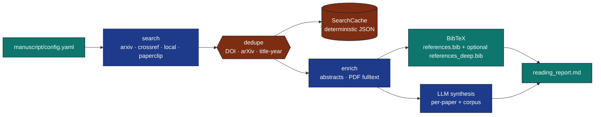

# template_search_project

A configurable, reproducible literature-search → BibTeX → LLM-synthesis
pipeline built on `infrastructure/search/`, `infrastructure/reference/`,
and `infrastructure/llm/`.

## What it does



## Quick start

```bash
# ── Standard (single-query) pipeline ────────────────────────────────
uv run python projects/template_search_project/scripts/run_search_pipeline.py
uv run python projects/template_search_project/scripts/run_search_pipeline.py --no-llm
uv run python projects/template_search_project/scripts/run_search_pipeline.py \
    --corpus path/to/corpus.json

# ── Deep search (multi-keyword) ─────────────────────────────────────
# Reads `deep_search:` block from config.yaml. Each keyword runs its
# own search (max 10 by default), every paper is fully enriched
# (abstract + fulltext), and each paper gets a multi-section LLM
# reading note. See manuscript/07_deep_search.md for details.
uv run python projects/template_search_project/scripts/run_deep_search.py --enable

# Override keyword list from the CLI:
uv run python projects/template_search_project/scripts/run_deep_search.py \
    --enable --keyword "convex optimization" --keyword "stochastic gradient descent"

# CI-safe (no LLM, no network):
uv run python projects/template_search_project/scripts/run_deep_search.py \
    --enable --no-llm \
    --corpus projects/template_search_project/data/corpus.json \
    --keyword "convex" --keyword "stochastic"
```

After the run, look in `output/`:

```mermaid
flowchart TB
    OUT[/output/]
    OUT --> SR[/search/]
    OUT --> CC[/cache/]
    OUT --> LD[/llm/]
    OUT --> CORP[corpus.json]
    OUT --> ELOG[enrichment_log.json]
    OUT --> RR[reading_report.md]
    OUT --> RS[run_summary.json]
    OUT --> FIG[/figures/]
    OUT --> DATA[/data/]

    SR --> SR_RES[results.json]
    SR --> SR_C[/cache/search_HASH.json/]

    CC --> CC_A[/abs/SAFE_ID.txt/]
    CC --> CC_P[/pdf/SAFE_ID.pdf and .txt/]

    LD --> LD_S[synthesis.md]
    LD --> LD_PP[/per_paper/SAFE_ID.md/]

    FIG --> F1[papers_per_source.png]
    FIG --> F2[year_histogram.png]
    FIG --> F3[score_distribution.png]

    DATA --> MV[manuscript_variables.json]

    MAN[/manuscript/]
    MAN --> BIB[references.bib · references_deep.bib<br/>merged at PDF render]

    classDef dir fill:#0f172a,stroke:#0f172a,color:#fff
    classDef file fill:#0f766e,stroke:#0f172a,color:#fff
    classDef bib fill:#1e3a8a,stroke:#0f172a,color:#fff
    class OUT,SR,CC,LD,FIG,DATA,MAN dir
    class SR_RES,SR_C,CC_A,CC_P,LD_S,LD_PP,CORP,ELOG,RR,RS,F1,F2,F3,MV file
    class BIB bib
```



## Configuration

Every knob lives in [`manuscript/config.yaml`](manuscript/config.yaml). The
defaults shown below are the values that ship with the bundled config —
they are **CI-safe / offline by default** so a fresh clone can render the
manuscript with no network and no Ollama server. Switching to live search
or enabling the LLM stage is a one-line edit (see [`docs/quickstart.md`](docs/quickstart.md)).

### `search:` (single-query pipeline)

| Key | Default | Meaning |
|---|---|---|
| `query` | `"reproducible research optimization"` | Free-text topic passed to every backend. |
| `max_results` | `100` | Per-backend cap; aggregator dedupes and re-applies year filters. |
| `year_min` / `year_max` | `null` | Optional inclusive year filter. |
| `sources` | `[local]` | Subset of `arxiv`, `crossref`, `local`, `paperclip`. |
| `local_corpus` | `data/corpus.json` | Path (relative to project root) consumed when `sources` includes `local`. |
| `crossref_mailto` | `you@example.org` | Polite-pool identifier sent to Crossref. |
| `paperclip` | `false` | Reserved flag for future per-source toggles. |
| `cache_dir` | `output/search/cache` | Deterministic JSON cache directory. |
| `cache_ttl_seconds` | `null` | Disable cache TTL (entries never expire). |

### `enrichment:`

| Key | Default | Meaning |
|---|---|---|
| `fetch_abstracts` | `true` | Use `AbstractFetcher` (arXiv export API + on-disk cache). |
| `fetch_fulltext` | `false` | Use `FulltextFetcher` (needs the optional `pypdf` dependency). |
| `abstract_cache_dir` | `output/cache/abs` | Per-paper `<safe_id>.txt` cache. |
| `fulltext_cache_dir` | `output/cache/pdf` | Per-paper `<safe_id>.{pdf,txt}` cache. |
| `max_fulltext_chars` | `400000` | Hard cap on the fulltext block fed to the LLM (≈ 100 k tokens for `gemma3:4b`). |

### `llm:` (Ollama-local synthesis; opt-in)

| Key | Default | Meaning |
|---|---|---|
| `enabled` | `false` | Skip the LLM stage entirely when `false` (CI-safe default). |
| `model` | `gemma3:4b` | Ollama model name. |
| `temperature` | `0.0` | Pinned for reproducibility. |
| `seed` | `42` | Pinned for reproducibility. |
| `per_paper` | `true` | Run `synthesise_per_paper` on every result. |
| `corpus_synthesis` | `true` | Run `synthesise_corpus` over the deduplicated set. |
| `output_dir` | `output/llm` | Where `synthesis.md` and `per_paper/<safe_id>.md` are written. |
| `context_window` | `131072` | Ollama context window passed to `LLMClient`. |
| `long_max_tokens` | `16384` | `query_long` token cap so multi-section reading notes are not truncated. |
| `max_input_length` | `600000` | Per-call input character cap. |
| `review_timeout` | `600.0` | Per-call timeout (seconds). |

### `report:`

| Key | Default | Meaning |
|---|---|---|
| `output_path` | `output/reading_report.md` | Final assembled markdown report. |
| `include_per_paper` | `true` | Include per-paper LLM notes in the final report. |
| `include_corpus_synthesis` | `true` | Include the corpus-level synthesis section. |

### `deep_search:` (multi-keyword fan-out; enabled by default)

| Key | Default | Meaning |
|---|---|---|
| `enabled` | `true` | Run end-to-end on every pipeline invocation. |
| `keywords` | `[convex optimization, stochastic gradient descent, reproducible research]` | One `SearchQuery` per keyword. |
| `max_results_per_keyword` | `100` | Per-keyword cap honoured by the aggregator. |
| `sources` | `[arxiv, crossref, paperclip]` | Backend list; `paperclip` degrades gracefully on a missing key or HTTP 405. |
| `year_min` / `year_max` | `null` | Optional inclusive year filter. |
| `crossref_mailto` | `you@example.org` | Polite-pool identifier. |
| `fetch_abstracts` | `true` | Enrich every paper with its abstract. |
| `fetch_fulltext` | `true` | Enrich every paper with its PDF fulltext. |
| `max_fulltext_chars` | `400000` | Hard cap fed to the per-paper LLM block. |
| `llm_per_paper` | `true` | Generate seven-section reading notes when Ollama is reachable. |
| `llm_model` | `gemma3:4b` | Ollama model. |
| `llm_seed` / `llm_temperature` | `42` / `0.0` | Pinned for reproducibility. |
| `llm_context_window` / `llm_long_max_tokens` / `llm_max_input_length` / `llm_review_timeout` | `null` | Per-stage Ollama overrides; `null` inherits from the `llm:` block. |
| `output_dir` | `output/deep_search` | Where per-keyword and aggregate outputs land. |
| `abstract_cache_dir` / `fulltext_cache_dir` / `search_cache_dir` | `output/cache/abs`, `output/cache/pdf`, `output/search/cache` | Shared with the standard pipeline so a single corpus is never refetched. |
| `write_unified_bibtex` | `true` | Emit the deduplicated unified bibliography. |
| `unified_bibtex_path` | `manuscript/references_deep.bib` | Where that bibliography is written. |

### Top-level

| Key | Default | Meaning |
|---|---|---|
| `references_path` | `manuscript/references.bib` | Where `run_search_pipeline.py` writes its (auto-populated) BibTeX. |

## Architecture

* `src/config.py` — typed YAML loader.
* `src/pipeline.py` — search → enrich → corpus → BibTeX. Pure orchestration over `infrastructure/`.
* `src/synthesis.py` — prompt construction + LLM-callable invocation.
* `src/report.py` — final markdown assembly.
* `scripts/run_deep_search.py`, `scripts/run_search_pipeline.py` — thin orchestrators. **No business logic.**
* `scripts/s_compose_literature_review.py` — composes `S01_literature_review.md` from the deep-search outputs (runs after `run_*` and before `y_*`/`z_*`).
* `scripts/y_generate_search_figures.py`, `scripts/z_generate_manuscript_variables.py`, `scripts/zz_generate_review_report.py` — project-analysis stage chain (lexicographic order).
* `tests/` — real-data tests; LLM tested with a deterministic local callable.
* Per-folder pointers: [`docs/README.md`](docs/README.md), [`manuscript/README.md`](manuscript/README.md), [`src/README.md`](src/README.md), [`tests/README.md`](tests/README.md), [`scripts/README.md`](scripts/README.md).

The project enforces the template's two-layer architecture: every reusable
component is in `infrastructure/`; only project-specific glue is in `src/`;
`scripts/` does only I/O and CLI argument handling.

## Testing

```bash
uv run pytest projects/template_search_project/tests/ -v
```

All tests use real implementations:

* `LocalBackend` against real temp files.
* HTTP backends would use `pytest-httpserver` (the infra-level tests already
  cover those, so this project's suite focuses on its orchestration logic).
* LLM behaviour tested with a deterministic local callable (no Ollama
  dependency at test time).

## Determinism

Four mechanisms make this workflow replayable:

1. **`SearchCache`** (`output/search/cache/search_<hash>.json`) — keyed on
   the canonical query identity (`sha256(text.strip().lower(), max_results,
   year_min, year_max, sorted(sources))[:16]`). Identical re-runs are
   file reads.
2. **`AbstractFetcher` cache** (`output/cache/abs/<safe_id>.txt`) — one
   abstract per paper, keyed on the paper's safe identifier.
3. **`FulltextFetcher` cache** (`output/cache/pdf/<safe_id>.{pdf,txt}`) —
   PDF bytes plus `pypdf`-extracted text. Live `pypdf` extraction is not
   bit-stable across versions; the cache freezes the first successful run.
4. **LLM seed + temperature** (`llm.seed: 42`, `llm.temperature: 0.0`) —
   Ollama is deterministic up to its own minor variance for these values.

Commit any subset of `output/search/cache/`, `output/cache/abs/`,
`output/cache/pdf/` (and the resulting `manuscript/references*.bib`) to
version control to freeze a run for CI.


## Review phase

Quality gate via [`scripts/review`](scripts/review) and [`review_config.yaml`](review_config.yaml). During the project-analysis stage, [`scripts/zz_generate_review_report.py`](scripts/zz_generate_review_report.py) runs last and invokes `scripts/review` when `output/review/summary.json` is missing, then writes `output/review/REVIEW_REPORT.md`.

```bash
# From repository root
uv run python projects/template_search_project/scripts/review \
  --project-root "$(pwd)/projects/template_search_project"

# List stages
uv run python projects/template_search_project/scripts/review --list \
  --project-root "$(pwd)/projects/template_search_project"
```

Artifacts: `output/review/stage_<name>.json`, `summary.json`, and `REVIEW_REPORT.md`. See [`AGENTS.md`](AGENTS.md#review-phase) for the stage table.

## Review configuration snapshot

Default enabled stages validate BibTeX, bibliography completeness vs manuscript cites, infrastructure imports, and determinism settings. Toggle stages in [`review_config.yaml`](review_config.yaml).

Run manually from the project directory: `uv run python scripts/review`.

## Related Documentation

* [`manuscript/SYNTAX.md`](manuscript/SYNTAX.md) — Pandoc citation / cross-reference conventions specific to this project.
* [`../../docs/guides/manuscript-semantics.md`](../../docs/guides/manuscript-semantics.md) — repository-wide canonical manuscript semantics.
* [`docs/modules/literature-search-and-references.md`](../../docs/modules/literature-search-and-references.md)
* [`docs/guides/literature-workflow-guide.md`](../../docs/guides/literature-workflow-guide.md)
* [`docs/architecture/discovery-export-synthesis.md`](../../docs/architecture/discovery-export-synthesis.md)
* [`docs/best-practices/literature-search-best-practices.md`](../../docs/best-practices/literature-search-best-practices.md)
* [`docs/security/literature-fetch-security.md`](../../docs/security/literature-fetch-security.md)
