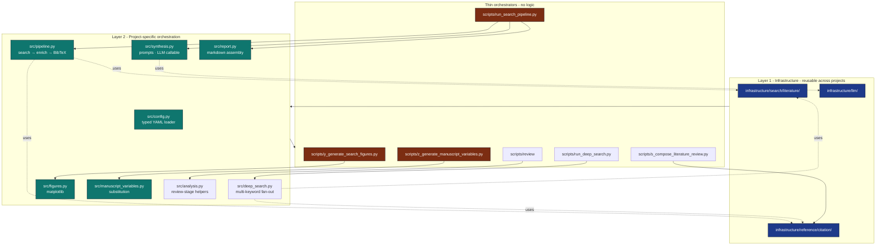

# Architecture

## Two-Layer Compliance

## Module Responsibilities

| Module | Pure? | Network? | Persistent state? |
|---|---|---|---|
| `config.py` | yes | no | reads YAML |
| `pipeline.py` | partial — calls infra HTTP backends transitively | yes (only when sources include arxiv/crossref/paperclip) | writes corpus, BibTeX, enrichment log |
| `deep_search.py` | partial — calls infra HTTP backends transitively | yes (only when sources include arxiv/crossref/paperclip) | writes per-keyword + aggregate JSON, deep BibTeX, per-paper notes |
| `synthesis.py` | yes (LLM is a callable arg) | no | none |
| `figures.py` | yes | no | writes PNG via callers |
| `manuscript_variables.py` | yes | no | writes JSON / resolved markdown via callers |
| `report.py` | yes | no | writes Markdown via callers |
| `analysis.py` | yes | no | none (review-stage helpers) |
| `dotenv.py` | yes | no | none (loads `.env` into `os.environ`) |

The `pipeline.py` module is the *only* place that touches
`infrastructure.search.*`; every other module receives data through
parameters or reads it from disk. This keeps the rest of the project
testable without `pytest-httpserver`.

## Why six analysis scripts?

The infrastructure pipeline runner discovers and executes every `*.py`
script in `scripts/` (excluding `_`-prefixed files) in **alphabetical
order**. We exploit this:

1. `run_deep_search.py` — runs first (alphabetically `r` < `s` < `y` < `z`);
   produces `output/deep_search/aggregate.json` and
   `manuscript/references_deep.bib`.
2. `run_search_pipeline.py` — runs second; produces
   `output/search/results.json` and `manuscript/references.bib`.
3. `s_compose_literature_review.py` — runs third; consumes the deep-search
   outputs to write `manuscript/S01_literature_review.md`.
4. `y_generate_search_figures.py` — runs fourth; consumes the standard-pipeline
   `results.json` to write the three diagnostic PNGs.
5. `z_generate_manuscript_variables.py` — runs fifth; consumes both the standard
   `results.json` and (when present) the deep-search aggregate to substitute
   `{{TOKEN}}` markers and copy the resolved markdown / `*.bib` into
   `output/manuscript/`.
6. `zz_generate_review_report.py` — runs last; aggregates per-stage review
   outputs into a single human-readable report.

This means a contributor adding a new analysis stage only needs to drop
in a new script with a name that sorts at the right point — no edits to
`pipeline.yaml` are required. The composer (`s_…`) deliberately precedes
the resolver (`z_…`) so the freshly composed S01 reaches the render stage.

## Citation-Key Determinism

`paper_to_bibentry()` produces `<author><year><title-word>` keys. When
two papers collide (a real concern for prolific same-year authors),
`pipeline._disambiguate_citation_key` appends `a`, `b`, …, `z`, `aa`, …
The result is deterministic across runs and exposed via
`LiteratureRunArtifacts.citation_keys` so the report and the BibTeX file
agree.

## Combined PDF and bibliographies

The infrastructure `PDFRenderer.render_combined` path runs Pandoc with
`--natbib`, emits a single LaTeX document, then BibTeX over
`\bibliography{stem1,stem2,...}` built from every `manuscript/*.bib`
(sorted). Pre-render citation checks union the same files so split
`references.bib` / `references_deep.bib` projects validate without false
“undefined citation” errors.

## Pipeline Idempotency

* Search: `SearchCache` keyed on canonical query identity. Re-runs with
  the same config produce byte-identical cache hits.
* Enrichment: per-paper `<safe_id>.{txt,pdf}` files. Re-runs are file
  reads.
* BibTeX: regenerated every time from in-memory state. Always identical
  for a given `corpus.json`.
* Figures: regenerated every time. Matplotlib's PNG output is stable
  across minor versions.
* LLM synthesis: deterministic when `seed=42, temperature=0.0` and the
  model version is pinned.

## See Also

- [`README.md`](../README.md) — top-level project overview.
- [`AGENTS.md`](../AGENTS.md) — agent-oriented walkthrough.
- [`docs/quickstart.md`](quickstart.md) — getting started.
- [`docs/output_conventions.md`](output_conventions.md) — what lands
  where on disk.
