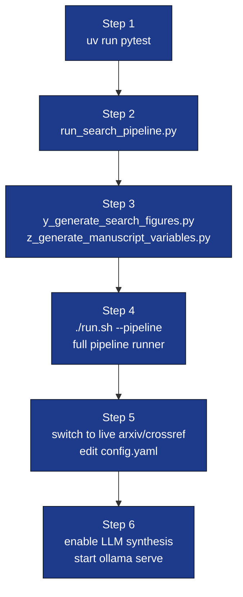

# Quickstart

This project ships a fully-runnable, **CI-safe**, **offline** literature
pipeline. You can render the manuscript with no network access on a fresh
clone.



## 1. Smoke-test in 5 seconds

```bash
uv run pytest projects/template_search_project/tests/ -q
```

All 30+ tests should pass without an internet connection.

## 2. Run the orchestrator end-to-end (offline)

```bash
uv run python projects/template_search_project/scripts/run_search_pipeline.py
```

This reads `manuscript/config.yaml` (default: `sources: [local]` ←
`data/corpus.json`), produces:

* `manuscript/references.bib` (Pandoc-ready BibTeX)
* `output/corpus.json`
* `output/search/results.json`
* `output/search/cache/search_<hash>.json`
* `output/reading_report.md`
* `output/run_summary.json`

…with no network calls and no Ollama dependency.

## 3. Generate figures + manuscript variables

```bash
uv run python projects/template_search_project/scripts/y_generate_search_figures.py
uv run python projects/template_search_project/scripts/z_generate_manuscript_variables.py
```

Outputs:

* `output/figures/{papers_per_source,year_histogram,score_distribution}.png`
* `output/data/manuscript_variables.json`
* `output/manuscript/` — resolved `*.md`, copied `config.yaml` and `*.bib` (PDF stage prefers this directory when it contains markdown)

## 4. Run under the full pipeline

```bash
./run.sh --project template_search_project --pipeline
```

The infrastructure pipeline runner:

1. Cleans `output/`
2. Runs infrastructure + project tests
3. Executes every `scripts/*.py` in alphabetical order: `run_deep_search.py`,
   `run_search_pipeline.py`, `s_compose_literature_review.py`,
   `y_generate_search_figures.py`, `z_generate_manuscript_variables.py`,
   `zz_generate_review_report.py`. The composer runs *before* the
   manuscript resolver so `output/manuscript/S01_literature_review.md`
   always reflects the latest `references_deep.bib` keys.
4. Renders the combined PDF (Pandoc `--natbib` + BibTeX; all `manuscript/*.bib` merged).
5. Validates the PDF
6. Optionally runs LLM review/translations

## 5. Switch to live search

Edit `manuscript/config.yaml`:

```yaml
search:
  query: "your topic"
  sources: [arxiv, crossref]
  crossref_mailto: "you@example.org"
```

Re-run step 2. The first run populates `output/search/cache/`; commit it
for reproducible re-runs across machines.

## 6. Enable LLM synthesis

```bash
ollama serve &
ollama pull gemma3:4b
```

Edit `manuscript/config.yaml`:

```yaml
llm:
  enabled: true
  model: "gemma3:4b"
  seed: 42
  temperature: 0.0
```

Re-run step 2. The orchestrator now writes:

* `output/llm/synthesis.md`
* `output/llm/per_paper/<safe_id>.md`

…and the reading report includes both sections.
