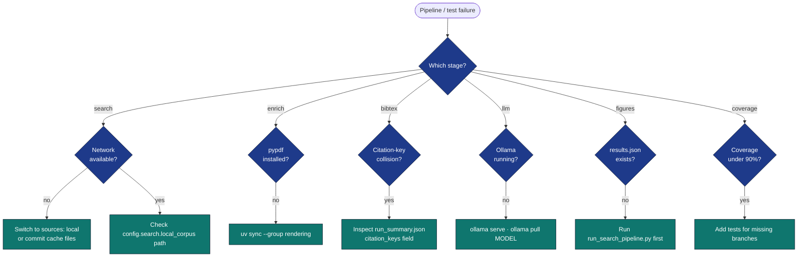

# Troubleshooting

## Diagnostic flow



## "Pipeline failed in Project Analysis stage"

**Symptom:** `./run.sh --project templates/template_search_project --pipeline` exits
on stage 4.

**Causes / fixes:**

1. *Network unavailable, but `config.yaml` lists `arxiv` / `crossref`.*
   Switch to `sources: [local]` or commit a populated
   `output/search/cache/`.
2. *Wrong `--corpus` path when `sources: [local]`.* The pipeline
   resolves `search.local_corpus` against the project root if
   `--corpus` is not provided; check the path exists.
3. *Default config disabled the LLM but a downstream test expects
   synthesis output.* Re-enable `llm.enabled: true`, ensure `ollama
   serve` is running, or update the test to use `synthesise_*` with a
   stub callable.

## "BibTeX missing entries / wrong citation keys"

**Symptom:** `manuscript/references.bib` does not contain a paper that
`output/search/results.json` does.

**Causes / fixes:**

1. *Citation-key collision.* Check `LiteratureRunArtifacts.citation_keys`
   in `output/run_summary.json`; collisions are auto-suffixed but the
   suffix is reflected in the BibTeX file.
2. *`config.search.year_min` / `year_max` filtered the paper.* Year
   filters apply to the search stage and re-apply defensively in the
   aggregator.
3. *Hand-edited `references.bib`.* The file is regenerated every run;
   do not hand-edit.

## "Pre-render validation failed (undefined citations)"

**Symptom:** `scripts/03_render_pdf.py` or
`python -m infrastructure.validation.cli prerender …` stops with many
`BIBTEX.UNDEFINED_KEY` errors for keys that exist in `references_deep.bib`.

**Cause / fix:** Ensure `references_deep.bib` lives next to the other
manuscript sections and that `s_compose_literature_review.py` ran
after `run_deep_search.py` when using Supplemental S1. The composer
sorts after `run_*` but before `y_*` / `z_*` so the freshly composed
`S01_literature_review.md` is in place before
`z_generate_manuscript_variables.py` resolves the manuscript into
`output/manuscript/`. The gate unions all `manuscript/*.bib`; a missing
second file means keys only in the deep bibliography will fail.

## "Figures missing"

**Symptom:** `output/figures/` is empty after a run.

**Causes / fixes:**

1. `output/search/results.json` does not exist — `y_generate_search_figures.py`
   exits 2 when there's no input. Run `run_search_pipeline.py` first.
2. Matplotlib backend issue — verify `MPLBACKEND=Agg` is set (the
   pipeline runner sets this automatically).

## "LLM stage produced no output"

**Symptom:** `output/llm/` is empty (or missing entirely) and the
reading report has no per-paper-notes / cross-corpus sections, even
though `config.llm.enabled: true` was set. The composer's Supplemental S1
also lacks a per-paper synthesis subsection.

**This is the no-stub design:** when the LLM stack is genuinely
unreachable, both `run_search_pipeline.py` and `run_deep_search.py` log
a warning ("infrastructure.llm not importable" or "Could not initialise
LLMClient") and skip the synthesis stage entirely — they do **not**
write a fake "(LLM unavailable …)" placeholder string. A missing LLM is
observable from the absence of those output files, never from a sentinel
in their contents.

**Causes / fixes:**

1. `infrastructure.llm` could not be imported — install with
   `uv sync --group llm`.
2. Ollama is not running — `ollama serve` and confirm `ollama list`
   shows the configured model.
3. Model not pulled — `ollama pull gemma3:4b` (or the model named in
   `config.llm.model`).
4. Check the pipeline log for the warning line — it identifies whether
   the import or the client construction failed.

## "References.bib differs across runs even with the local corpus"

**Symptom:** `git status` shows `manuscript/references.bib` modified
after a `--no-cache` run.

**Causes / fixes:**

* `data/corpus.json` itself changed. The BibTeX is a deterministic
  function of the corpus and the citation-key generator; if both are
  unchanged, the output is identical.
* Field order in a manually-edited corpus entry shifted. The BibTeX
  writer preserves order, so reorder the corpus JSON to match.

## "Coverage gate failure"

**Symptom:** `pytest projects/templates/template_search_project/tests/` exits with
"coverage below 90".

**Causes / fixes:**

* Add tests for the missing branches reported in the coverage output.
* Untested code in `src/` is the most common cause; `scripts/` is *not*
  in the coverage source tree.

## "ImportPathMismatchError when running tests"

**Symptom:**
```
_pytest.pathlib.ImportPathMismatchError: ('tests.conftest', ...)
```
when running `pytest tests/ projects/templates/template_search_project/tests/`
together.

**Cause:** Both directories are named `tests/` and pytest's import path
discovery confuses them.

**Fix:** Run them separately. The infrastructure pipeline always invokes
them in separate subprocess calls so this only affects ad-hoc usage.
