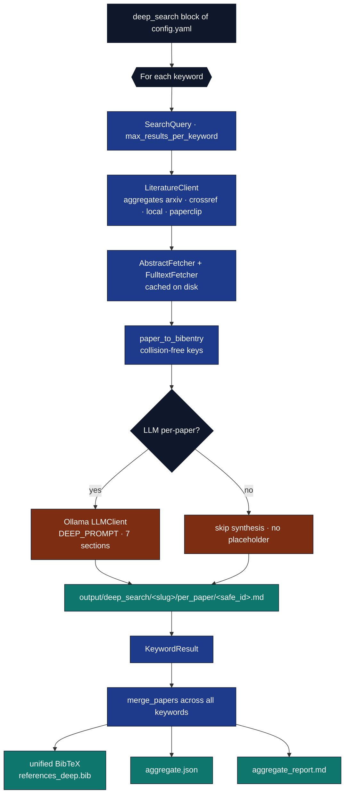
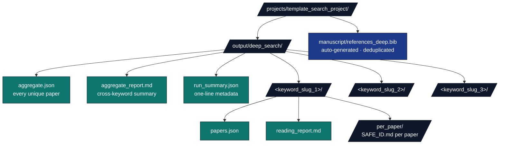

# Deep Search {#sec:deep_search}

The deep-search workflow extends the standard literature pipeline along three axes: **breadth** (multi-keyword fan-out), **depth** (full enrichment of every paper, abstract + PDF fulltext), and **archival quality** (per-paper multi-section LLM reading notes saved as standalone markdown). It is invoked from the same configuration file but a separate orchestrator script.

## Configuration

The `deep_search:` block in `manuscript/config.yaml` controls the run. The most-used knobs:

* `keywords` — list of free-text queries (each becomes one `SearchQuery`).
* `max_results_per_keyword` — per-keyword cap (100 by default; honoured by the aggregator after dedup).
* `sources` — backend list, same vocabulary as the standard pipeline (`arxiv`, `crossref`, `local`, `paperclip`).
* `fetch_abstracts` / `fetch_fulltext` — when both are `true`, every returned paper has its abstract fetched (arXiv export API) and (where a PDF URL is available) its fulltext extracted via `pypdf`. Cached on disk under `output/cache/abs/` and `output/cache/pdf/`.
* `llm_per_paper` — when `true` and Ollama is reachable, each paper gets a multi-section markdown reading note generated by the local LLM. When `false`, or when the LLM stack is genuinely unreachable at runtime, the per-paper note is written with only the abstract / fulltext-excerpt sections; the synthesis section is omitted entirely (no placeholder text). The composer's Supplemental S1 also drops the per-paper synthesis subsection in that case rather than emitting empty rows.
* `write_unified_bibtex` / `unified_bibtex_path` — when `true`, a deduplicated, collision-suffixed BibTeX file is written under `manuscript/references_deep.bib` so it can be cited from the manuscript via Pandoc `[@key]` syntax exactly the same way as the hand-curated `references.bib`.

## Pipeline shape

The deep-search pipeline reads the `deep_search:` block from `manuscript/config.yaml`, runs one `SearchQuery` per keyword (capped at `max_results_per_keyword`), aggregates the per-backend results through `LiteratureClient`, enriches every paper via `AbstractFetcher` and `FulltextFetcher`, generates collision-free citation keys with `paper_to_bibentry`, and (when `llm_per_paper: true` and Ollama is reachable) calls the local LLM with `DEEP_PROMPT` to produce a seven-section reading note per paper. The per-keyword outputs are then merged by `merge_papers` to form a deduplicated aggregate roster which is written to `manuscript/references_deep.bib`, `output/deep_search/aggregate.json`, and `output/deep_search/aggregate_report.md`. A Mermaid flowchart in this subsection renders the same flow visually in the HTML build.



## LLM prompt

The deep-search prompt is richer than the standard `synthesis.PROMPT_PER_PAPER`. It produces a self-contained reading note suitable for archival without re-reading the paper:

```
## Contribution
One paragraph stating the paper's central claim and why it is novel.

## Method
2-4 bullets describing the technical approach.

## Evidence
2-4 bullets describing experiments / proofs.

## Limitations
1-3 bullets covering caveats and what the paper does NOT address.

## Connections
1-3 bullets relating this paper to other work in the field, citing only
papers explicitly named in the input.

## Significance for {keyword}
One paragraph explaining why this paper matters for the keyword.

## Tags
5-10 lowercase keywords.
```

The LLM is duck-typed as `Callable[[str], str]` so tests pass a deterministic local callable that returns real, well-formed reading-note text; runtime callers wrap an `infrastructure.llm.LLMClient` with `seed=42, temperature=0.0` for reproducibility. When the LLM stack is unreachable, callers pass `None` and the per-paper synthesis stage is skipped entirely — no placeholder text is ever written into the archive.

## On-disk layout

A successful deep-search run writes the following artefacts (paths shown relative to the project root); a Mermaid tree in this subsection renders the same hierarchy in the HTML build:

* `output/deep_search/aggregate.json` — every unique paper across keywords.
* `output/deep_search/aggregate_report.md` — cross-keyword markdown summary.
* `output/deep_search/run_summary.json` — one-line metadata for the run.
* `output/deep_search/<keyword_slug>/papers.json` — enriched per-keyword paper list.
* `output/deep_search/<keyword_slug>/reading_report.md` — per-keyword markdown summary.
* `output/deep_search/<keyword_slug>/per_paper/<safe_id>.md` — one reading note per paper.
* `manuscript/references_deep.bib` — auto-generated, deduplicated unified BibTeX file.



## Determinism

Three caches make this workflow replayable:

1. `SearchCache` (`output/search/cache/search_<hash>.json`) — keyed on canonical query identity per keyword.
2. Abstract cache (`output/cache/abs/<safe_id>.txt`).
3. Fulltext cache (`output/cache/pdf/<safe_id>.{pdf,txt}`).
4. LLM seed (`deep_search.llm_seed: 42`) + temperature (`0.0`).

Commit any subset of these caches to version control to freeze a run.

## Paperclip backend

The [Paperclip backend](https://paperclip.gxl.ai) is opt-in. Enable it
by:

1. Creating `projects/template_search_project/.env` (gitignored) with
   your `PAPERCLIP_API_KEY=gxl_…` (template at `.env.example`).
2. Including `paperclip` in `deep_search.sources`.

The orchestrator scripts auto-load `.env` via the lightweight
`src.dotenv` module before constructing the backend list. The
`PaperclipBackend` adapter mirrors the wire protocol of the official
`gxl_paperclip` Python SDK: `POST /papers` with an `X-API-Key` header
and a JSON-RPC `tools/call` envelope. We support both the modern
`structuredContent.papers` response shape and the older text-only
`content[].text` shape (best-effort regex extraction).

Failure-isolation: any per-backend error (including the migration-state
HTTP 405 the production endpoint may currently return) is captured into
`SearchResult.errors[paperclip]` and the run continues. See
`output/deep_search/<keyword>/papers.json` and the aggregate
`run_summary.json` for the recorded errors.

## CLI

```bash
# Run with everything from config.yaml (assumes deep_search.enabled: true)
uv run python projects/template_search_project/scripts/run_deep_search.py

# Force-enable without touching config.yaml
uv run python projects/template_search_project/scripts/run_deep_search.py --enable

# Override keyword list at the command line
uv run python projects/template_search_project/scripts/run_deep_search.py \
    --enable --keyword "convex optimization" --keyword "stochastic gradient descent"

# Skip LLM stage even when config enables it
uv run python projects/template_search_project/scripts/run_deep_search.py --enable --no-llm

# Bypass cache (writes still happen)
uv run python projects/template_search_project/scripts/run_deep_search.py --enable --no-cache

# Local-corpus mode (offline · CI-friendly)
uv run python projects/template_search_project/scripts/run_deep_search.py \
    --enable --corpus projects/template_search_project/data/corpus.json
```
