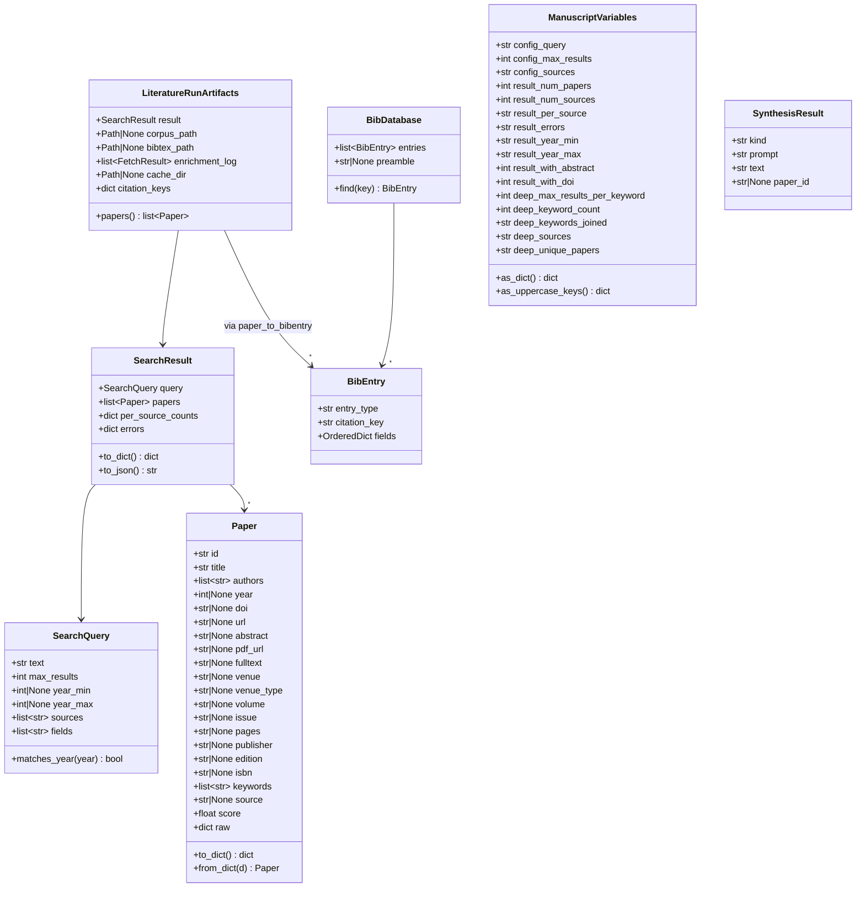

# Pipeline Internals {#sec:pipeline_internals}

This supplemental section documents the data structures and on-disk artifacts the pipeline produces, for readers who want to extend or audit it.

## Data structures

The Mermaid class diagram in this subsection shows the canonical fields each record carries through the pipeline. Records have additional optional metadata (e.g. `Paper.url`, `Paper.publisher`, `Paper.isbn`, `Paper.raw`) omitted for readability — consult `infrastructure/search/literature/models.py` ([source on GitHub](https://github.com/docxology/template/tree/main/infrastructure/search/literature)) and `src/pipeline.py` ([source on GitHub](https://github.com/docxology/template/tree/main/projects/templates/template_search_project/src)) for the full schema.

## On-disk layout

The project keeps committed input data in `data/`, regeneratable outputs in `output/` (gitignored), and the manuscript source in `manuscript/`. The Mermaid flowchart in this subsection (rendered in the HTML build; the PDF build strips Mermaid) lists every artefact the standard pipeline writes:

* `data/corpus.json` — the bundled offline corpus, CI-safe default for `LocalBackend`.
* `output/search/results.json` — raw `SearchResult` JSON from the latest run.
* `output/search/cache/search_<hash>.json` — deterministic `SearchCache` files.
* `output/cache/abs/<safe_id>.txt` — one cached abstract per paper.
* `output/cache/pdf/<safe_id>.{pdf,txt}` — PDF bytes plus extracted text.
* `output/llm/synthesis.md` — corpus-level LLM synthesis (when enabled).
* `output/llm/per_paper/<safe_id>.md` — one per-paper note per paper (when enabled).
* `output/figures/{papers_per_source,year_histogram,score_distribution}.png` — diagnostic figures.
* `output/data/manuscript_variables.json` — substitution table consumed by the resolver.
* `output/corpus.json` — enriched corpus, written in `LocalBackend`-compatible format so it can re-seed a deterministic future run.
* `output/enrichment_log.json` — one entry per fetcher per paper.
* `output/reading_report.md` — final markdown reading report.
* `output/run_summary.json` — one-line metadata for the run.
* `manuscript/references.bib` — auto-populated, Pandoc-ready BibTeX.

```mermaid
flowchart TB
    P["projects/templates/template_search_project/"]
    P --> DAT["data/<br/>committed"]
    P --> OUT["output/<br/>regeneratable · gitignored"]
    P --> MAN["manuscript/"]

    DAT --> CORP_IN[corpus.json<br/>bundled offline corpus<br/>CI-safe default]

    OUT --> SR["search/"]
    OUT --> CC["cache/"]
    OUT --> LD["llm/"]
    OUT --> FIG["figures/"]
    OUT --> DD["data/"]
    OUT --> CORP_OUT[corpus.json<br/>enriched · LocalBackend-compatible]
    OUT --> ELOG[enrichment_log.json<br/>per-fetch status]
    OUT --> RR[reading_report.md]
    OUT --> RS[run_summary.json]

    SR --> SR_R[results.json<br/>SearchResult]
    SR --> SR_C["cache/search_HASH.json<br/>deterministic SearchCache"]

    CC --> CC_A["abs/SAFE_ID.txt"]
    CC --> CC_P["pdf/SAFE_ID.pdf and .txt"]

    LD --> LD_S[synthesis.md]
    LD --> LD_PP["per_paper/SAFE_ID.md"]

    FIG --> F1[papers_per_source.png]
    FIG --> F2[year_histogram.png]
    FIG --> F3[score_distribution.png]

    DD --> MV[manuscript_variables.json]

    MAN --> BIB[references.bib<br/>auto-populated · Pandoc-ready]

    classDef dir fill:#0f172a,stroke:#0f172a,color:#fff
    classDef gen fill:#0f766e,stroke:#0f172a,color:#fff
    classDef src fill:#1e3a8a,stroke:#0f172a,color:#fff
    class P,DAT,OUT,MAN,SR,CC,LD,FIG,DD dir
    class CORP_OUT,ELOG,RR,RS,SR_R,SR_C,CC_A,CC_P,LD_S,LD_PP,F1,F2,F3,MV,BIB gen
    class CORP_IN src
```

## Citation-key collision handling

`paper_to_bibentry()` generates citation keys as `<author><year><title-word>` (with stop-words filtered and unicode folded). When two papers in the same result set produce the same key — common when one author publishes multiple papers in the same year on closely related topics — `src/pipeline.py::_disambiguate_citation_key` appends a deterministic suffix from the alphabet (`a`, `b`, …, `z`, then two-letter combinations `aa`, `ab`, …) until uniqueness is restored, with a numeric `_1`, `_2`, … fallback for the pathological case. The mapping is exposed to downstream stages via `LiteratureRunArtifacts.citation_keys`, and the report uses these keys verbatim, so the LLM synthesis and the BibTeX file always agree.

The deep-search workflow has its own collision handler in `src/deep_search.py::run_deep_search` that operates over the post-deduplication aggregate roster — see [@sec:deep_search] — and the unified `references_deep.bib` reflects the same mapping.

## Failure isolation

* **A backend is unreachable.** `LiteratureClient` records the message into `result.errors[name]` and continues. The reading report surfaces these errors in a callout block at the top.
* **An abstract fetch fails.** The fetcher records `status="error"` in `enrichment_log.json` and the paper keeps its existing (possibly empty) abstract.
* **A PDF fetch fails or `pypdf` is missing.** Same pattern — the PDF, if downloaded, is still cached on disk. The reading report does not reference the missing fulltext.
* **The LLM is unreachable or unconfigured.** `scripts/run_search_pipeline.py` logs a warning and skips the synthesis stage entirely — `output/llm/` is left empty and the reading report omits both the per-paper-notes and cross-corpus sections. No placeholder text is ever written into the archive, so a missing LLM is observable from the absence of those sections rather than from a fake "(LLM unavailable)" string.
