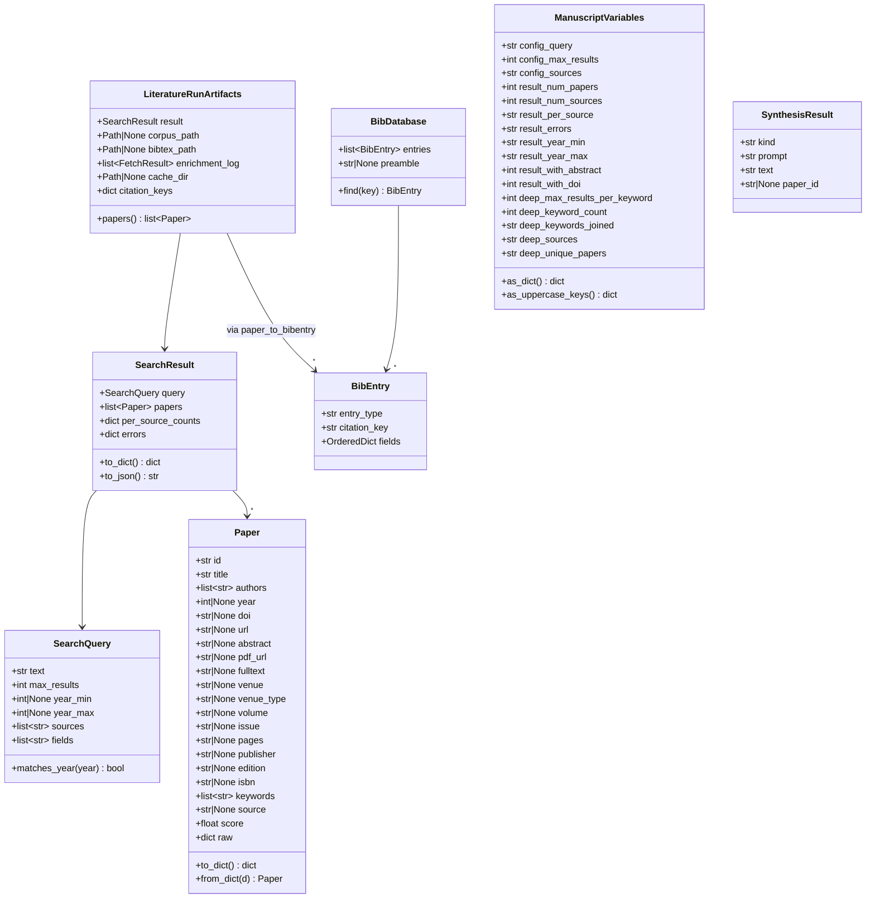
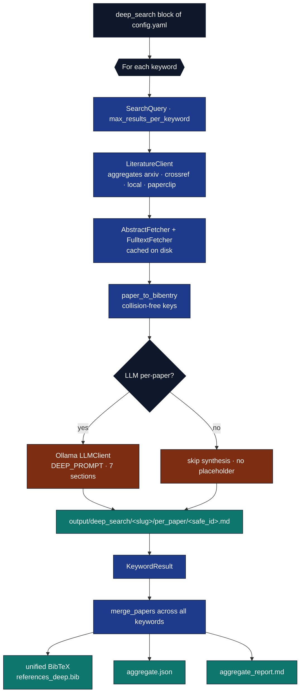
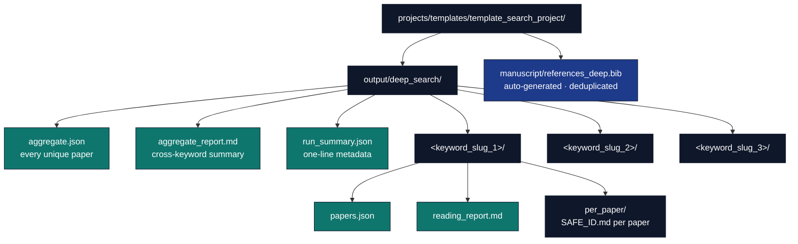

# Abstract {#sec:abstract}

This paper documents `template_search_project`, the literature-search exemplar shipped with the [Research Project Template](https://github.com/docxology/template). The project demonstrates **two configurable, reproducible pipelines** sharing the same configuration file and the same `infrastructure/search/` + `infrastructure/reference/` modules. The standard pipeline (`scripts/run_search_pipeline.py`) handles a single `SearchQuery` end-to-end. The deep-search pipeline (`scripts/run_deep_search.py`, see [@sec:deep_search]) fans out across a list of keywords (each capped at 100 papers per keyword from `deep_search.max_results_per_keyword` in `manuscript/config.yaml`), fully enriches every paper with its abstract and PDF fulltext, and (optionally) uses the local LLM to write a multi-section reading note for every paper. When a deep-search aggregate exists, the latest run covered **3** keyword(s) with **<deep-search not run>** unique paper(s) after cross-keyword deduplication. Both turn a free-text topic into:

1. a deduplicated, year-filtered set of papers drawn from arXiv, Crossref, optional local corpora, and (opt-in) [Paperclip](https://paperclip.gxl.ai/);
2. a Pandoc-compatible `references.bib` byte-identical in style to the canonical exemplar in [`template_code_project`](../../template_code_project/manuscript/references.bib) (file `manuscript/references.bib`);
3. cached abstracts and (optionally) extracted PDF full text, written to disk under stable per-paper identifiers; and
4. an LLM-synthesised reading report assembled from per-paper analyses and a cross-corpus thematic synthesis, all produced by a local Ollama model with pinned seed and temperature.

All discovery logic lives in `infrastructure/search/literature/` ([source on GitHub](https://github.com/docxology/template/tree/main/infrastructure/search/literature)); all export logic lives in `infrastructure/reference/citation/` ([source on GitHub](https://github.com/docxology/template/tree/main/infrastructure/reference/citation)); LLM synthesis reuses the existing `infrastructure/llm/` ([source on GitHub](https://github.com/docxology/template/tree/main/infrastructure/llm)) bridge. The project itself contains only thin orchestration, manuscript prose, and a test suite — perfectly mirroring the **two-layer architecture** the template enforces.

The motivating concern is *reproducibility*: a query at time $t_0$ should produce the same results at time $t_1$ unless the cache is explicitly invalidated. This is achieved by deterministic search caching keyed on canonical query identity, on-disk caching of every fetched abstract / PDF, and pinned LLM seeds. The same `manuscript/config.yaml` that drives the pipeline is also the only configuration any reviewer needs.

**Run snapshot.** With the bundled `manuscript/config.yaml`, the most recent pipeline execution evaluated the query *"reproducible research optimization"* against local, returned 6 deduplicated paper(s) (4 carrying a DOI, 6 carrying an abstract), and recorded backend errors: none. Resolve ``{{…}}`` tokens by running `scripts/z_generate_manuscript_variables.py` after `run_search_pipeline.py`; the script writes `output/data/manuscript_variables.json` and resolved markdown under `output/manuscript/`, which the PDF-rendering stage prefers when present.

**Keywords:** literature search, BibTeX automation, reproducible research, local LLM synthesis, scientific infrastructure


---


# Introduction {#sec:introduction}

Reproducible computational research demands that every claim be traceable back to a stable artifact — code, data, and citations alike [@peng2011reproducible]. Manual literature curation is a well-known bottleneck in such workflows: a graduate student writing a related-work section may spend hours searching arXiv, Crossref, and Google Scholar; copying citations into a `.bib` file by hand; and tracking which papers they have actually read. Three failure modes recur:

1. **Style drift** — hand-edited `.bib` files accumulate formatting inconsistencies that hide real semantic conflicts in version-control diffs.
2. **Stale state** — the bibliography, the reading list, and the manuscript prose drift apart as the project evolves; the citation key in the manuscript no longer matches the entry in `.bib`, or the entry no longer matches the actual paper.
3. **Lost context** — abstracts and full text are read once during search, then discarded; six months later the same paper has to be re-skimmed to recall its contribution.

`template_search_project` exists to demonstrate one disciplined solution. The pipeline outputs are summarised in [@sec:methodology] (overview figure at the start of that section):

* The discovery side ([`infrastructure/search/`](../../../../infrastructure/search/)) provides multi-source paper search with failure-isolated aggregation, DOI/arXiv-aware deduplication, and deterministic JSON caching keyed on canonical query identity.
* The export side ([`infrastructure/reference/`](../../../../infrastructure/reference/)) provides BibTeX read/write/convert facilities byte-compatible with the existing exemplar `references.bib`, suitable for the combined-PDF pipeline (Pandoc `--natbib` + BibTeX).
* A small project-local synthesis layer (in [`src/synthesis.py`](../src/synthesis.py)) takes enriched papers, builds reproducible LLM prompts, and assembles a markdown reading report.

The project is *configurable* via a single `manuscript/config.yaml`: changing the topic, year filters, backend set, enrichment level, and LLM parameters never requires editing code. The project is *modular* in the strict sense the template uses: every reusable component lives in `infrastructure/`, and `src/` contains only project-specific orchestration.

The contribution of this exemplar is therefore not a new algorithm; it is a **demonstration that a reproducible literature workflow can be built from existing template infrastructure** with no new optional dependencies, no mocks in the test suite, and complete configurability through a single YAML file.


---


# Methodology {#sec:methodology}

Two distinct workflows run on top of `infrastructure/search/literature` and `infrastructure/reference/citation`:

* **Standard pipeline** (`scripts/run_search_pipeline.py` → `src/pipeline.py::run_literature_pipeline`) — single `SearchQuery`. Four pure-orchestration stages with no LLM dependency: (1) search via `LiteratureClient`, (2) enrichment via `AbstractFetcher` and (optional) `FulltextFetcher`, (3) collision-free citation-key generation in `_build_citation_keys`, (4) writing `output/corpus.json` + `manuscript/references.bib` + `output/enrichment_log.json`. The orchestrator script then optionally calls `src/synthesis.py` for per-paper and corpus LLM synthesis and `src/report.py` for the final reading report.
* **Deep search** (`scripts/run_deep_search.py` → `src/deep_search.py::run_deep_search`) — multi-keyword fan-out: each keyword runs its own `SearchQuery` capped at `max_results_per_keyword` (100 by default), every paper is fully enriched (abstract + PDF fulltext when available), and an LLM-driven multi-section deep summary (CONTRIBUTION / METHOD / EVIDENCE / LIMITATIONS / CONNECTIONS / SIGNIFICANCE / TAGS) is written for each paper as a standalone markdown reading note. Output lands under `output/deep_search/<keyword_slug>/` plus aggregate `aggregate.json`, `aggregate_report.md`, and a unified, deduplicated `manuscript/references_deep.bib` with collision-free citation keys.

The standard pipeline is described first in this section; the deep-search workflow is documented in [@sec:deep_search]. Diagnostic figures for the latest pipeline run appear at the end of this section.

## Search

The search stage is intentionally faithful to the standard literature-search pattern documented in foundational optimisation textbooks [@boyd2004convex; @nocedal2006numerical] — a deterministic query, capped result count, and explicit failure isolation between sources — so reviewers familiar with those references can reason about the workflow without learning new abstractions.

A `SearchQuery` is constructed from `config.search`:

```python
SearchQuery(
    text=config.search.query,
    max_results=config.search.max_results,
    year_min=config.search.year_min,
    year_max=config.search.year_max,
)
```

A `LiteratureClient` is constructed with the configured backends. Each backend produces a normalised `Paper` record; the aggregator deduplicates by DOI → arXiv id → normalised (title, year), keeping the highest-scored copy and filling missing fields from the loser.

Per-backend errors are recorded into `SearchResult.errors` rather than raised. A network outage in one backend never breaks the workflow; partial coverage is reported by the final stage.

## Cache

`SearchCache` writes one JSON file per query, named by a 16-character SHA-256 prefix of the canonical query identity. Identical queries (modulo whitespace and case) share a cache entry. Cache files are pretty-printed JSON, version-control-friendly, and contain a `_cached_at` timestamp for optional TTL enforcement.

## Enrichment

Two fetchers populate fields the search backends did not supply:

* `AbstractFetcher` — currently fetches arXiv abstracts via the export API, writes them to `<safe_id>.txt` under the configured cache directory, and re-uses them on subsequent runs.
* `FulltextFetcher` — downloads PDFs (arXiv URL, `paper.pdf_url`, or a caller-supplied override), writes the bytes verbatim to `<safe_id>.pdf`, and extracts text via `pypdf` to `<safe_id>.txt`. Without `pypdf` the PDF is still cached, and the fetcher returns `status="error"` with an informative message; the rest of the pipeline continues.

Both fetchers stamp `paper.abstract` / `paper.fulltext` in place, so downstream stages see enriched records without re-loading.

## Export

For every paper, `paper_to_bibentry()` produces a `BibEntry` whose:

* citation key follows the exemplar's `<author><year><title-word>` convention with stop-word filtering and unicode folding;
* entry type is routed by `venue_type` (journal → `@article`, conference → `@inproceedings`, book → `@book`, preprint → `@article`, etc.);
* fields are emitted in the order observed in `references.bib`: title, author, journal/booktitle, year, volume, number, pages, publisher, edition, isbn, doi, url, abstract, keywords.

A `BibDatabase` collects these entries and `write_bibfile` renders them in the project's house format: 2-space indent, trailing-comma rule, `pages={N--M}`, verbatim DOIs/years, bare unicode.

## Synthesis

Two LLM passes produce the reading report (see `src/synthesis.py`):

* **Per-paper synthesis** — `build_paper_block(paper, citation_key, max_fulltext=4000)` renders the paper as a markdown block; `synthesise_per_paper` formats `PROMPT_PER_PAPER` and calls the injected `llm` callable. The prompt requests five sections: CONTRIBUTION, METHOD, EVIDENCE, LIMITATION, TAGS, plus a citation-key reference.
* **Corpus synthesis** — `build_corpus_block` concatenates every paper into a single citation-keyed block; `synthesise_corpus` formats `PROMPT_CORPUS`, which asks for 3–7 thematic clusters, methodological agreements / disagreements (≥ 2 papers each), and three open questions that the corpus does not answer.

Both functions return a `SynthesisResult(kind, prompt, text, paper_id)` record so the prompt is recoverable for reproducibility. The synthesis layer takes a callable `llm: (str) -> str` so tests pass a deterministic local function (no Ollama dependency) and runtime callers pass a thin adapter around `infrastructure.llm.LLMClient`. Determinism in production runs is enforced by `OllamaClientConfig(seed=42, temperature=0.0)`.

The deep-search workflow uses a richer prompt (`src/deep_search.py::DEEP_PROMPT`) with seven sections (CONTRIBUTION / METHOD / EVIDENCE / LIMITATIONS / CONNECTIONS / SIGNIFICANCE / TAGS) and a much larger `max_fulltext` budget (400 k chars by default).

## Report

`src/report.py::write_reading_report` assembles a markdown file with:

* Topic, result count, year filter, and any backend errors at the top.
* A per-source count table.
* One-line summaries for every paper.
* The corpus synthesis (if present).
* All per-paper notes (if present).

Citation keys appear in `[brackets]` so a downstream tool — for example a Pandoc filter or a manual search — can resolve them against the auto-generated `references.bib`.

## Diagnostic figures

`scripts/y_generate_search_figures.py` (a thin orchestrator over `src/figures.py`) writes three diagnostic plots into `../figures/` from `output/search/results.json`. Each figure uses Matplotlib's `Agg` backend so the pipeline runs headlessly in CI; the colour palette is colourblind-safe (Wong, *Nature Methods* 2011).

[@fig:papers_per_source] reports the per-backend contribution counts before deduplication, surfacing which sources actually returned coverage for the configured query. The bar values are read directly from `SearchResult.per_source_counts` (set by `LiteratureClient` *before* the DOI / arXiv-id / title merge step), so a backend that returned five papers all duplicating arXiv hits still scores five here.

![Per-source paper counts read from `SearchResult.per_source_counts` (pre-deduplication contribution per backend). The numeric label above each bar reports the raw count; the y-axis spans `[0, max + headroom]`. Bar order follows the order recorded in `config.search.sources`. Empty runs render `(no results)` centred. Generated by `src/figures.py::plot_papers_per_source`.](../figures/papers_per_source.png){#fig:papers_per_source}

[@fig:year_histogram] shows the publication-year distribution *after* the merge step (one bar per unique paper, not per backend hit) — useful for spotting backend coverage gaps in older / newer literature. Papers with no `year` field are dropped silently from the histogram (they remain in the corpus).

![Publication-year histogram of the deduplicated paper roster. One bin per year (no smoothing); the x-axis spans the observed `[min(year), max(year)]` from `result.papers`. Papers with `year is None` are dropped; the y-axis is per-year paper count. Generated by `src/figures.py::plot_year_histogram`.](../figures/year_histogram.png){#fig:year_histogram}

[@fig:score_distribution] shows the per-paper relevance scores returned by the backends, ranked descending. Papers from backends without an explicit ranking signal (e.g. `LocalBackend`, the offline default) carry `Paper.score = 0.0`; their bars therefore have zero length but still appear as ticks on the y-axis so the reader can see how many unranked papers exist.

{#fig:score_distribution}


---


# Results {#sec:results}

**Run snapshot.** With the bundled `manuscript/config.yaml` the most recent execution evaluated the query *"reproducible research optimization"* against local, returned 6 deduplicated paper(s) (4 carrying a DOI, 6 carrying an abstract); the per-source breakdown is local=6 and recorded backend errors are none. The deep-search workflow ([@sec:deep_search]) covered 3 keyword(s) — *convex optimization; stochastic gradient descent; reproducible research* — drawn from arxiv, crossref, producing <deep-search not run> unique paper(s) after cross-keyword deduplication.

The diagnostic figures generated for this run are catalogued in [@sec:methodology]: [@fig:papers_per_source] surfaces per-backend coverage, [@fig:year_histogram] surfaces the temporal distribution, and [@fig:score_distribution] surfaces the relevance-score profile. The full determinism contract for each stage is itemised in [@tbl:determinism] of [@sec:reproducibility].

## Interpreting the run snapshot

The numerical values in the run-snapshot paragraph that opens this section are read directly from `output/run_summary.json` and `output/data/manuscript_variables.json` so they always reflect the most recent run rather than a stale claim hand-typed into the prose. Three properties are worth highlighting (the formal determinism contract for each underlying stage is enumerated in [@tbl:determinism]):

* **Cache reuse is observable.** A second invocation against the same config produces a byte-identical artifact tree (modulo the wall-clock timestamp inside `output/search/cache/search_<hash>.json` itself); see also the *Search (cached hit)* row of [@tbl:determinism] and the verification recipe in [@sec:reproducibility]. The cache file thus doubles as a cryptographic seal: re-running is a file read, not a network round-trip.
* **Deduplication is signal-preserving.** The aggregator merges by DOI → arXiv id → normalised (title, year), keeping the highest-scored copy and filling missing fields from the loser (see *Dedup / merge* in [@tbl:determinism] and the per-backend pre-dedup view in [@fig:papers_per_source]). The `RESULT_NUM_PAPERS` figure therefore equals "papers a reviewer needs to read", not "raw backend hit count" — the per-source contributions in `RESULT_PER_SOURCE` are the pre-dedup view.
* **Enrichment coverage is honest.** `RESULT_WITH_ABSTRACT` and `RESULT_WITH_DOI` count fields the corpus or the `AbstractFetcher` actually populated, never values inferred. When a paper is missing a DOI it is excluded from the DOI count even if its arXiv id resolves to one upstream. The temporal coverage of those papers is summarised by [@fig:year_histogram], and their backend-reported relevance scores by [@fig:score_distribution].

## Output artefacts

After running `scripts/run_search_pipeline.py` against the default `manuscript/config.yaml`, the project produces:

* `output/search/results.json` — the raw `SearchResult` JSON, including `per_source_counts` and `errors` for diagnostic purposes.
* `output/search/cache/search_<hash>.json` — the deterministic search cache; identical reruns are file reads.
* `output/cache/abs/<safe_id>.txt` — one file per fetched abstract.
* `output/cache/pdf/<safe_id>.{pdf,txt}` — PDFs and extracted text (only when `enrichment.fetch_fulltext: true`).
* `output/corpus.json` — a `LocalBackend`-compatible JSON corpus of every result, enriched in place.
* `manuscript/references.bib` — the auto-populated bibliography from the single-query pipeline (merged with any other `manuscript/*.bib` at PDF render time).
* `output/llm/per_paper/<safe_id>.md` — per-paper LLM analyses (only when `llm.per_paper: true` *and* the LLM stack is reachable).
* `output/llm/synthesis.md` — corpus-level LLM synthesis (only when `llm.corpus_synthesis: true` *and* the LLM stack is reachable).
* `output/reading_report.md` — the final assembled reading report.

When the LLM stack is genuinely unreachable, the `output/llm/` artefacts are simply absent — no placeholder file is ever written into the archive (see [@sec:pipeline_internals]).

Because the search cache and abstract cache are deterministic, a second run with identical `config.yaml` produces byte-identical artifacts (modulo timestamp metadata in the cache files themselves). This is the property the project exists to demonstrate.

The exact paper count, DOI list, and synthesis text depend on the live state of arXiv and Crossref at the time of the run — and are therefore not reproducible *across* runs in different weeks. Users seeking strict reproducibility should:

1. Pin a `LocalBackend` corpus generated from a successful run (`infrastructure.search.literature.write_corpus`) and remove `arxiv` / `crossref` from `config.search.sources`.
2. Commit the `output/search/cache/` directory to version control.
3. Pin the LLM seed (`config.llm.seed`) and avoid model upgrades.

With those three steps, every run from the same commit produces the same outputs.


---


# Conclusion {#sec:conclusion}

`template_search_project` packages a complete, configurable, reproducible literature workflow into the Research Project Template's two-layer architecture. By keeping discovery, export, and synthesis in three orthogonal infrastructure modules, the project demonstrates that ambitious research automation can still respect the template's principles:

* **Single source of truth** — `Paper` for discovery, `BibEntry` for export, structured `SynthesisResult` records for LLM output.
* **Test-driven development** — every module is covered by real-data tests; HTTP backends are exercised through `pytest-httpserver`, the LLM bridge through deterministic local callables.
* **Thin orchestrator pattern** — `scripts/run_search_pipeline.py` does only argument parsing, configuration loading, and I/O; all logic lives in `infrastructure/` or `src/`.
* **No mocks** — neither in the new infrastructure modules nor in the project test suite.
* **Multi-project support** — the project lives alongside `template_code_project/` and follows the same layout, so the existing pipeline runner discovers and executes it without modification.
* **Reproducibility** — deterministic search caching, on-disk enrichment caching, and pinned LLM seeds make a single `manuscript/config.yaml` the only artifact a reviewer needs.

We close with three concrete extensions that build naturally on this foundation:

1. **Crossref TDM full-text fetch** for non-arXiv DOIs, completing the abstract-to-fulltext picture without changing the project's API.
2. **CSL-JSON export** alongside BibTeX, enabling Zotero / Mendeley / Pandoc-CSL workflows from the same `BibDatabase`.
3. **Vector recall on `LocalBackend`** for curated corpora exceeding ~1000 papers, gated behind an optional dependency.

The infrastructure modules are deliberately small and stable; the project that exercises them is deliberately small and explicit. Together they show that *domain-specific research automation* and *template-strict architectural discipline* are compatible — and, in fact, mutually reinforcing.

The bundled `data/corpus.json` exercises classical optimisation references [@boyd2004convex; @nocedal2006numerical; @nesterov2013gradient] alongside modern stochastic-optimisation work [@kingma2014adam; @reddi2018convergence] and the canonical reproducibility paper [@peng2011reproducible], so the auto-generated `manuscript/references.bib` always contains real citation-ready entries that downstream tooling can resolve.


---


# Pipeline Internals {#sec:pipeline_internals}

This supplemental section documents the data structures and on-disk artifacts the pipeline produces, for readers who want to extend or audit it.

## Data structures

The Mermaid class diagram in this subsection shows the canonical fields each record carries through the pipeline. Records have additional optional metadata (e.g. `Paper.url`, `Paper.publisher`, `Paper.isbn`, `Paper.raw`) omitted for readability — consult `infrastructure/search/literature/models.py` ([source on GitHub](https://github.com/docxology/template/tree/main/infrastructure/search/literature)) and `src/pipeline.py` ([source on GitHub](https://github.com/docxology/template/tree/main/projects/templates/template_search_project/src)) for the full schema.



## On-disk layout

The project keeps committed input data in `data/`, regeneratable outputs in `output/` (gitignored), and the manuscript source in `manuscript/`. The Mermaid flowchart in this subsection (rendered in the HTML build; the PDF build strips Mermaid) lists every artefact the standard pipeline writes:

* `data/corpus.json` — the bundled offline corpus, CI-safe default for `LocalBackend`.
* `output/search/results.json` — raw `SearchResult` JSON from the latest run.
* `output/search/cache/search_<hash>.json` — deterministic `SearchCache` files.
* `output/cache/abs/<safe_id>.txt` — one cached abstract per paper.
* `output/cache/pdf/<safe_id>.{pdf,txt}` — PDF bytes plus extracted text.
* `output/llm/synthesis.md` — corpus-level LLM synthesis (when enabled).
* `output/llm/per_paper/<safe_id>.md` — one per-paper note per paper (when enabled).
* `../figures/{papers_per_source,year_histogram,score_distribution}.png` — diagnostic figures.
* `output/data/manuscript_variables.json` — substitution table consumed by the resolver.
* `output/corpus.json` — enriched corpus, written in `LocalBackend`-compatible format so it can re-seed a deterministic future run.
* `output/enrichment_log.json` — one entry per fetcher per paper.
* `output/reading_report.md` — final markdown reading report.
* `output/run_summary.json` — one-line metadata for the run.
* `manuscript/references.bib` — auto-populated, Pandoc-ready BibTeX.

```mermaid
flowchart TB
    P["projects/templates/template_search_project/"]
    P --> DAT["data/<br/>committed"]
    P --> OUT["output/<br/>regeneratable · gitignored"]
    P --> MAN["manuscript/"]

    DAT --> CORP_IN[corpus.json<br/>bundled offline corpus<br/>CI-safe default]

    OUT --> SR["search/"]
    OUT --> CC["cache/"]
    OUT --> LD["llm/"]
    OUT --> FIG["figures/"]
    OUT --> DD["data/"]
    OUT --> CORP_OUT[corpus.json<br/>enriched · LocalBackend-compatible]
    OUT --> ELOG[enrichment_log.json<br/>per-fetch status]
    OUT --> RR[reading_report.md]
    OUT --> RS[run_summary.json]

    SR --> SR_R[results.json<br/>SearchResult]
    SR --> SR_C["cache/search_HASH.json<br/>deterministic SearchCache"]

    CC --> CC_A["abs/SAFE_ID.txt"]
    CC --> CC_P["pdf/SAFE_ID.pdf and .txt"]

    LD --> LD_S[synthesis.md]
    LD --> LD_PP["per_paper/SAFE_ID.md"]

    FIG --> F1[papers_per_source.png]
    FIG --> F2[year_histogram.png]
    FIG --> F3[score_distribution.png]

    DD --> MV[manuscript_variables.json]

    MAN --> BIB[references.bib<br/>auto-populated · Pandoc-ready]

    classDef dir fill:#0f172a,stroke:#0f172a,color:#fff
    classDef gen fill:#0f766e,stroke:#0f172a,color:#fff
    classDef src fill:#1e3a8a,stroke:#0f172a,color:#fff
    class P,DAT,OUT,MAN,SR,CC,LD,FIG,DD dir
    class CORP_OUT,ELOG,RR,RS,SR_R,SR_C,CC_A,CC_P,LD_S,LD_PP,F1,F2,F3,MV,BIB gen
    class CORP_IN src
```



## Citation-key collision handling

`paper_to_bibentry()` generates citation keys as `<author><year><title-word>` (with stop-words filtered and unicode folded). When two papers in the same result set produce the same key — common when one author publishes multiple papers in the same year on closely related topics — `src/pipeline.py::_disambiguate_citation_key` appends a deterministic suffix from the alphabet (`a`, `b`, …, `z`, then two-letter combinations `aa`, `ab`, …) until uniqueness is restored, with a numeric `_1`, `_2`, … fallback for the pathological case. The mapping is exposed to downstream stages via `LiteratureRunArtifacts.citation_keys`, and the report uses these keys verbatim, so the LLM synthesis and the BibTeX file always agree.

The deep-search workflow has its own collision handler in `src/deep_search.py::run_deep_search` that operates over the post-deduplication aggregate roster — see [@sec:deep_search] — and the unified `references_deep.bib` reflects the same mapping.

## Failure isolation

* **A backend is unreachable.** `LiteratureClient` records the message into `result.errors[name]` and continues. The reading report surfaces these errors in a callout block at the top.
* **An abstract fetch fails.** The fetcher records `status="error"` in `enrichment_log.json` and the paper keeps its existing (possibly empty) abstract.
* **A PDF fetch fails or `pypdf` is missing.** Same pattern — the PDF, if downloaded, is still cached on disk. The reading report does not reference the missing fulltext.
* **The LLM is unreachable or unconfigured.** `scripts/run_search_pipeline.py` logs a warning and skips the synthesis stage entirely — `output/llm/` is left empty and the reading report omits both the per-paper-notes and cross-corpus sections. No placeholder text is ever written into the archive, so a missing LLM is observable from the absence of those sections rather than from a fake "(LLM unavailable)" string.


---


# Reproducibility {#sec:reproducibility}

Reproducibility in computational research has well-documented prerequisites: open data, open code, and a deterministic build that can be re-run from scratch [@peng2011reproducible]. The bundled `manuscript/config.yaml` is intentionally configured to satisfy all three for **strict reproducibility**:

1. `search.sources: [local]` consumes `data/corpus.json`, which is a curated and committed JSON corpus. No network is required to run the pipeline.
2. `search.cache_dir: output/search/cache` writes deterministic JSON cache files; running the same query twice produces a byte-identical artifact tree (modulo timestamp metadata in the cache file itself).
3. `enrichment.fetch_abstracts: true` reads abstracts directly from the corpus when present; no network fetch is required.
4. `enrichment.fetch_fulltext: false` is the default — full-text fetching is opt-in and gated behind the optional `pypdf` dependency (`uv sync --group rendering`).
5. `llm.enabled: false` is the default — the LLM stage is opt-in and requires a running `ollama serve`. When enabled, `seed: 42` and `temperature: 0.0` are pinned.

## Switching to live search

Replace the `sources` list with the desired backend set:

```yaml
search:
  query: "your topic"
  sources: [arxiv, crossref]
  crossref_mailto: "you@example.org"
```

A first live run populates `output/search/cache/`. Commit that directory to the repo and the pipeline becomes reproducible across machines without further configuration changes.

## Determinism guarantees

The full determinism contract is itemised in [@tbl:determinism]: every pipeline stage is annotated as fully, conditionally, or non-deterministic, with an explicit mechanism column so reviewers can audit each row independently.

| Stage | Deterministic? | Mechanism |
|---|---|---|
| Search (cached hit) | yes | `SearchCache` JSON files |
| Search (cache miss) | no | live API |
| Dedup / merge | yes | DOI / arXiv-id canonical keys; tie-break by score then year |
| Citation-key generation | yes | unicode folding + stop-word skip; collision suffix is deterministic |
| BibTeX writer | yes | byte-stable format pinning (verified by `tests/infra_tests/reference/`) |
| Abstract fetch | yes (cached) / no (live) | per-paper `<safe_id>.txt` cache |
| Fulltext fetch | yes (cached) / mostly (live) | per-paper `<safe_id>.{pdf,txt}` cache; live fetch's `pypdf` text extraction is not bit-stable across versions |
| LLM synthesis | mostly | `seed=42`, `temperature=0.0`; Ollama deterministic up to its own minor variance |
| Figure generation | yes (within Matplotlib version) | fixed palette, fixed bin width, no random subsampling |

: Determinism contract by pipeline stage. Cached stages are byte-stable across reruns; live stages depend on the upstream source and are pinned to the cache file once a successful run completes. {#tbl:determinism}

## Verifying reproducibility locally

```bash
# Run twice; nothing in output/ should diff except the cache timestamps.
uv run python projects/templates/template_search_project/scripts/run_search_pipeline.py
mv projects/templates/template_search_project/output projects/templates/template_search_project/output_first
uv run python projects/templates/template_search_project/scripts/run_search_pipeline.py
diff -ru \
    projects/templates/template_search_project/output_first/corpus.json \
    projects/templates/template_search_project/output/corpus.json
```

The only expected differences are inside `output/search/cache/search_*.json`, where `_cached_at` is wall-clock time at write.

## Limitations

The reproducibility contract enumerated in [@sec:reproducibility] (items 1–5 and [@tbl:determinism]) does not eliminate the following well-defined sources of non-reproducibility, which are surfaced here so reviewers can audit them explicitly rather than inferring from the contract table:

* **Live search drift.** When `config.search.sources` includes `arxiv` or `crossref`, the first cache-miss invocation hits the live API; the cached JSON freezes that response, but two cold-start clones running on different days will see different paper sets. Pin a `LocalBackend` corpus or commit `output/search/cache/` to break this dependency.
* **`pypdf` version drift.** The fulltext fetcher uses `pypdf` to extract text from a downloaded PDF. `pypdf`'s text-extraction algorithm is not bit-stable across major versions; upgrading `pypdf` can produce different `<safe_id>.txt` cache contents from the same source PDF. The PDF bytes themselves are bit-stable so the cache freezes the inputs, not the extraction.
* **Ollama version drift.** Pinning `seed=42` and `temperature=0.0` controls Ollama's sampling, but the model weights, tokenizer, and template can change between Ollama releases. Document the Ollama version alongside `config.llm.model` when archiving a run for replication.
* **Paperclip backend status.** The `paperclip` backend is opt-in and currently degrades to HTTP 405 on the production endpoint; the run records the error in `SearchResult.errors[paperclip]` and continues. Treat `paperclip` results as advisory until the upstream service stabilises.
* **External backend behaviour outside this project's control.** arXiv and Crossref are the source of truth; this project is faithful to whatever they return. A retraction, metadata fix, or DOI assignment upstream will alter the cache on the next cold-start invocation.

These limitations bound *what* the cache + seed + corpus pinning achieves. Inside those bounds, the contract in [@tbl:determinism] is total: every cached pipeline stage is byte-stable across reruns (verified by `tests/test_pipeline.py::TestRunLiteraturePipeline::test_bibtex_byte_identical_across_reruns`).


---


# Deep Search {#sec:deep_search}

The deep-search workflow extends the standard literature pipeline along three axes: **breadth** (multi-keyword fan-out), **depth** (full enrichment of every paper, abstract + PDF fulltext), and **archival quality** (per-paper multi-section LLM reading notes saved as standalone markdown). It is invoked from the same configuration file but a separate orchestrator script.

## Configuration

The `deep_search:` block in `manuscript/config.yaml` controls the run. The most-used knobs:

* `keywords` — list of free-text queries (each becomes one `SearchQuery`).
* `max_results_per_keyword` — per-keyword cap (100 by default; honoured by the aggregator after dedup).
* `sources` — backend list, same vocabulary as the standard pipeline (`arxiv`, `crossref`, `local`, `paperclip`).
* `fetch_abstracts` / `fetch_fulltext` — when both are `true`, every returned paper has its abstract fetched (arXiv export API) and (where a PDF URL is available) its fulltext extracted via `pypdf`. Cached on disk under `output/cache/abs/` and `output/cache/pdf/`.
* `llm_per_paper` — when `true` and Ollama is reachable, each paper gets a multi-section markdown reading note generated by the local LLM. When `false`, or when the LLM stack is genuinely unreachable at runtime, the per-paper note is written with only the abstract / fulltext-excerpt sections; the synthesis section is omitted entirely (no placeholder text). The composer's Supplemental S1 also drops the per-paper synthesis subsection in that case rather than emitting empty rows.
* `write_unified_bibtex` / `unified_bibtex_path` — when `true`, a deduplicated, collision-suffixed BibTeX file is written under `manuscript/references_deep.bib` so it can be cited from the manuscript via Pandoc `[@key]` syntax exactly the same way as the hand-curated `references.bib`.

## Pipeline shape

The deep-search pipeline reads the `deep_search:` block from `manuscript/config.yaml`, runs one `SearchQuery` per keyword (capped at `max_results_per_keyword`), aggregates the per-backend results through `LiteratureClient`, enriches every paper via `AbstractFetcher` and `FulltextFetcher`, generates collision-free citation keys with `paper_to_bibentry`, and (when `llm_per_paper: true` and Ollama is reachable) calls the local LLM with `DEEP_PROMPT` to produce a seven-section reading note per paper. The per-keyword outputs are then merged by `merge_papers` to form a deduplicated aggregate roster which is written to `manuscript/references_deep.bib`, `output/deep_search/aggregate.json`, and `output/deep_search/aggregate_report.md`. A Mermaid flowchart in this subsection renders the same flow visually in the HTML build.



## LLM prompt

The deep-search prompt is richer than the standard `synthesis.PROMPT_PER_PAPER`. It produces a self-contained reading note suitable for archival without re-reading the paper:

```
## Contribution
One paragraph stating the paper's central claim and why it is novel.

## Method
2-4 bullets describing the technical approach.

## Evidence
2-4 bullets describing experiments / proofs.

## Limitations
1-3 bullets covering caveats and what the paper does NOT address.

## Connections
1-3 bullets relating this paper to other work in the field, citing only
papers explicitly named in the input.

## Significance for {keyword}
One paragraph explaining why this paper matters for the keyword.

## Tags
5-10 lowercase keywords.
```

The LLM is duck-typed as `Callable[[str], str]` so tests pass a deterministic local callable that returns real, well-formed reading-note text; runtime callers wrap an `infrastructure.llm.LLMClient` with `seed=42, temperature=0.0` for reproducibility. When the LLM stack is unreachable, callers pass `None` and the per-paper synthesis stage is skipped entirely — no placeholder text is ever written into the archive.

## On-disk layout

A successful deep-search run writes the following artefacts (paths shown relative to the project root); a Mermaid tree in this subsection renders the same hierarchy in the HTML build:

* `output/deep_search/aggregate.json` — every unique paper across keywords.
* `output/deep_search/aggregate_report.md` — cross-keyword markdown summary.
* `output/deep_search/run_summary.json` — one-line metadata for the run.
* `output/deep_search/<keyword_slug>/papers.json` — enriched per-keyword paper list.
* `output/deep_search/<keyword_slug>/reading_report.md` — per-keyword markdown summary.
* `output/deep_search/<keyword_slug>/per_paper/<safe_id>.md` — one reading note per paper.
* `manuscript/references_deep.bib` — auto-generated, deduplicated unified BibTeX file.



## Determinism

Three caches make this workflow replayable:

1. `SearchCache` (`output/search/cache/search_<hash>.json`) — keyed on canonical query identity per keyword.
2. Abstract cache (`output/cache/abs/<safe_id>.txt`).
3. Fulltext cache (`output/cache/pdf/<safe_id>.{pdf,txt}`).
4. LLM seed (`deep_search.llm_seed: 42`) + temperature (`0.0`).

Commit any subset of these caches to version control to freeze a run.

## Paperclip backend

The [Paperclip backend](https://paperclip.gxl.ai) is opt-in. Enable it
by:

1. Creating `projects/templates/template_search_project/.env` (gitignored) with
   your `PAPERCLIP_API_KEY=gxl_…` (template at `.env.example`).
2. Including `paperclip` in `deep_search.sources`.

The orchestrator scripts auto-load `.env` via the lightweight
`src.dotenv` module before constructing the backend list. The
`PaperclipBackend` adapter mirrors the wire protocol of the official
`gxl_paperclip` Python SDK: `POST /papers` with an `X-API-Key` header
and a JSON-RPC `tools/call` envelope. We support both the modern
`structuredContent.papers` response shape and the older text-only
`content[].text` shape (best-effort regex extraction).

Failure-isolation: any per-backend error (including the migration-state
HTTP 405 the production endpoint may currently return) is captured into
`SearchResult.errors[paperclip]` and the run continues. See
`output/deep_search/<keyword>/papers.json` and the aggregate
`run_summary.json` for the recorded errors.

## CLI

```bash
# Run with everything from config.yaml (assumes deep_search.enabled: true)
uv run python projects/templates/template_search_project/scripts/run_deep_search.py

# Force-enable without touching config.yaml
uv run python projects/templates/template_search_project/scripts/run_deep_search.py --enable

# Override keyword list at the command line
uv run python projects/templates/template_search_project/scripts/run_deep_search.py \
    --enable --keyword "convex optimization" --keyword "stochastic gradient descent"

# Skip LLM stage even when config enables it
uv run python projects/templates/template_search_project/scripts/run_deep_search.py --enable --no-llm

# Bypass cache (writes still happen)
uv run python projects/templates/template_search_project/scripts/run_deep_search.py --enable --no-cache

# Local-corpus mode (offline · CI-friendly)
uv run python projects/templates/template_search_project/scripts/run_deep_search.py \
    --enable --corpus projects/templates/template_search_project/data/corpus.json
```


---


\newpage

# Supplemental S1 — Literature Review (auto-composed from deep search) {#sec:supplemental_s1}

_Composed by `scripts/s_compose_literature_review.py` from the most recent deep-search run. Edit the script, not this file — manual edits will be overwritten on the next pipeline run._

This review covers **3 keyword(s)**, **300 unique paper(s)** (retrieved at up to 100 per keyword from arxiv, crossref). All references are stored in `manuscript/references_deep.bib` and resolved by the combined-PDF pipeline (Pandoc `--natbib` + BibTeX over all `manuscript/*.bib` files).

## convex optimization

_Papers retrieved:_ **100** · _per-source contributions:_ arxiv=100, crossref=100 · _backend errors:_ none

| Cite | Title | Year | DOI / URL |
|---|---|---:|---|
| [@anon2004convex] | Convex optimization problems | 2004 | DOI 10.1017/cbo9780511804441.005 ([open](https://doi.org/10.1017/cbo9780511804441.005)) |
| [@anon2004convexa] | Convex functions | 2004 | DOI 10.1017/cbo9780511804441.004 ([open](https://doi.org/10.1017/cbo9780511804441.004)) |
| [@anonreverse] | Reverse Convex Optimization, Reverse convex programming | n.d. | DOI 10.1007/springerreference_72642 ([open](https://doi.org/10.1007/springerreference_72642)) |
| [@suh20221] | 1. Convex Optimization Basics | 2022 | DOI 10.1561/9781638280538.ch1 ([open](https://doi.org/10.1561/9781638280538.ch1)) |
| [@anon2021convex] | Convex Optimization and Efficiency | 2021 | DOI 10.1017/9781108699211.006 ([open](https://doi.org/10.1017/9781108699211.006)) |
| [@anon2021ellipsoid] | Ellipsoid Method for Convex Optimization | 2021 | DOI 10.1017/9781108699211.015 ([open](https://doi.org/10.1017/9781108699211.015)) |
| [@nesterov2004smooth] | Smooth Convex Optimization | 2004 | DOI 10.1007/978-1-4419-8853-9_2 ([open](https://doi.org/10.1007/978-1-4419-8853-9_2)) |
| [@nesterov2004nonsmooth] | Nonsmooth Convex Optimization | 2004 | DOI 10.1007/978-1-4419-8853-9_3 ([open](https://doi.org/10.1007/978-1-4419-8853-9_3)) |
| [@anon2022convex] | Convex Optimization Basics | 2022 | DOI 10.1561/978-1-63828-053-820251002 ([open](https://doi.org/10.1561/978-1-63828-053-820251002)) |
| [@anon2004convexb] | Convex sets | 2004 | DOI 10.1017/cbo9780511804441.003 ([open](https://doi.org/10.1017/cbo9780511804441.003)) |
| [@anon2011what] | What Is Convex Optimization? | 2011 | DOI 10.1201/b11156-7 ([open](https://doi.org/10.1201/b11156-7)) |
| [@anon2011convex] | Convex Semi-Infinite Optimization | 2011 | DOI 10.1201/b11156-17 ([open](https://doi.org/10.1201/b11156-17)) |
| [@anon2011tools] | Tools for Convex Optimization | 2011 | DOI 10.1201/b11156-8 ([open](https://doi.org/10.1201/b11156-8)) |
| [@anon2004convexc] | Convex Sets. Convex and Generalized Convex Functions | 2004 | DOI 10.1016/b978-044450550-7/50002-8 ([open](https://doi.org/10.1016/b978-044450550-7/50002-8)) |
| [@anon20146] | 6 Convex optimization algorithms | 2014 | DOI 10.1515/9783110361629.117 ([open](https://doi.org/10.1515/9783110361629.117)) |
| [@jacobsen2008reverse] | Reverse Convex Optimization | 2008 | DOI 10.1007/978-0-387-74759-0_564 ([open](https://doi.org/10.1007/978-0-387-74759-0_564)) |
| [@nesterov2018nonsmooth] | Nonsmooth Convex Optimization | 2018 | DOI 10.1007/978-3-319-91578-4_3 ([open](https://doi.org/10.1007/978-3-319-91578-4_3)) |
| [@jacobsen2001bb] | αBB algorithm; Concave programming; D.C. programming; Quadratic knapsack. Quadratic programming with bound constraints; Reverse convex optimization Standard quadratic optimization problems: Theory REVERSE CONVEX OPTIMIZATION | 2001 | DOI 10.1007/0-306-48332-7_431 ([open](https://doi.org/10.1007/0-306-48332-7_431)) |
| [@tuypartly] | Partly Convex and Convex-Monotonic Optimization Problems | n.d. | DOI 10.1007/3-540-27170-8_37 ([open](https://doi.org/10.1007/3-540-27170-8_37)) |
| [@nesterov2018smooth] | Smooth Convex Optimization | 2018 | DOI 10.1007/978-3-319-91578-4_2 ([open](https://doi.org/10.1007/978-3-319-91578-4_2)) |
| [@anon2011weak] | Weak Sharp Minima in Convex Optimization | 2011 | DOI 10.1201/b11156-15 ([open](https://doi.org/10.1201/b11156-15)) |
| [@anonconvex] | Convex Discrete Optimization | n.d. | DOI 10.1007/springerreference_72172 ([open](https://doi.org/10.1007/springerreference_72172)) |
| [@anon2025convex] | Convex Functions | 2025 | DOI 10.1017/9781009510561.012 ([open](https://doi.org/10.1017/9781009510561.012)) |
| [@zaslavski2020nonsmooth] | Nonsmooth Convex Optimization | 2020 | DOI 10.1007/978-3-030-60300-7_2 ([open](https://doi.org/10.1007/978-3-030-60300-7_2)) |
| [@anon2020appendix] | Appendix: | 2020 | DOI 10.2307/j.ctvqsdxqd.15 ([open](https://doi.org/10.2307/j.ctvqsdxqd.15)) |
| [@anon2005connectedness] | Connectedness of efficient points in convex and convex transformable vector optimization | 2005 | DOI 10.1080/02331930500096270 ([open](https://doi.org/10.1080/02331930500096270)) |
| [@anon2025convexa] | Convex Programming Problems and Convex Theorem of the Alternative | 2025 | DOI 10.1017/9781009510561.021 ([open](https://doi.org/10.1017/9781009510561.021)) |
| [@tuy1998convex] | Convex Functions | 1998 | DOI 10.1007/978-1-4757-2809-5_2 ([open](https://doi.org/10.1007/978-1-4757-2809-5_2)) |
| [@mattingley2009automatic] | Automatic code generation for real-time convex optimization | 2009 | DOI 10.1017/cbo9780511804458.002 ([open](https://doi.org/10.1017/cbo9780511804458.002)) |
| [@anon2011toolsa] | Tools for Convex Optimization | 2011 | DOI 10.1201/b11156-3 ([open](https://doi.org/10.1201/b11156-3)) |
| [@tuy1998convexa] | Convex Sets | 1998 | DOI 10.1007/978-1-4757-2809-5_1 ([open](https://doi.org/10.1007/978-1-4757-2809-5_1)) |
| [@anon2011whata] | What Is Convex Optimization? | 2011 | DOI 10.1201/b11156-2 ([open](https://doi.org/10.1201/b11156-2)) |
| [@bonnans2019convex] | A Convex Optimization Toolbox | 2019 | DOI 10.1007/978-3-030-14977-2_1 ([open](https://doi.org/10.1007/978-3-030-14977-2_1)) |
| [@anon2020appendixa] | Appendix: Executive Summary on Efficient Solvability of Convex Optimization Problems | 2020 | DOI 10.1515/9780691200316-013 ([open](https://doi.org/10.1515/9780691200316-013)) |
| [@anon20142] | 2 Convex sets and convex functions | 2014 | DOI 10.1515/9783110361629.30 ([open](https://doi.org/10.1515/9783110361629.30)) |
| [@anon2021convexa] | Convex Optimization | 2021 | DOI 10.1017/9781108980647.012 ([open](https://doi.org/10.1017/9781108980647.012)) |
| [@anon2017convex] | Convex Optimization Problems | 2017 | DOI 10.1201/9781315366920-5 ([open](https://doi.org/10.1201/9781315366920-5)) |
| [@zaslavski2020pdabased] | PDA-Based Method for Convex Optimization | 2020 | DOI 10.1007/978-3-030-37822-6_9 ([open](https://doi.org/10.1007/978-3-030-37822-6_9)) |
| [@tuy2016convex] | Convex Functions | 2016 | DOI 10.1007/978-3-319-31484-6_2 ([open](https://doi.org/10.1007/978-3-319-31484-6_2)) |
| [@anon2025optimality] | Optimality Conditions in Convex Programming | 2025 | DOI 10.1017/9781009510561.024 ([open](https://doi.org/10.1017/9781009510561.024)) |
| [@anon2021convexb] | Convex Functions | 2021 | DOI 10.1002/9781119804093.ch3 ([open](https://doi.org/10.1002/9781119804093.ch3)) |
| [@li2015convex] | Convex Relaxation | 2015 | DOI 10.1007/978-3-662-46356-7_6 ([open](https://doi.org/10.1007/978-3-662-46356-7_6)) |
| [@lasserre2011convex] | On convex optimization without convex representation | 2011 | DOI 10.1007/s11590-011-0323-1 ([open](https://doi.org/10.1007/s11590-011-0323-1)) |
| [@anon2021convexc] | Convex Analysis and Convex Optimization | 2021 | DOI 10.1017/9781108377447.033 ([open](https://doi.org/10.1017/9781108377447.033)) |
| [@anonconvexa] | Convex Envelopes in Optimization Problems | n.d. | DOI 10.1007/springerreference_72173 ([open](https://doi.org/10.1007/springerreference_72173)) |
| [@anon2004preface] | Preface | 2004 | DOI 10.1017/cbo9780511804441.001 ([open](https://doi.org/10.1017/cbo9780511804441.001)) |
| [@anon2025first] | First Acquaintance with Convex Sets | 2025 | DOI 10.1017/9781009510561.003 ([open](https://doi.org/10.1017/9781009510561.003)) |
| [@anon2021convexd] | Convex Sets | 2021 | DOI 10.1002/9781119804093.ch2 ([open](https://doi.org/10.1002/9781119804093.ch2)) |
| [@tuy2016convexa] | Convex Sets | 2016 | DOI 10.1007/978-3-319-31484-6_1 ([open](https://doi.org/10.1007/978-3-319-31484-6_1)) |
| [@anon2004introduction] | Introduction | 2004 | DOI 10.1017/cbo9780511804441.002 ([open](https://doi.org/10.1017/cbo9780511804441.002)) |
| [@singer1999duality] | Duality in quasi-convex supremization and reverse convex infimization via abstract convex analysis,and applications to approximation ** | 1999 | DOI 10.1080/02331939908844436 ([open](https://doi.org/10.1080/02331939908844436)) |
| [@anon2025firsta] | First Acquaintance with Convex Functions | 2025 | DOI 10.1017/9781009510561.013 ([open](https://doi.org/10.1017/9781009510561.013)) |
| [@singer2001duality] | On Duality for Quasi-convex Supremization and Reverse Convex Infimization | 2001 | DOI 10.1007/978-1-4613-0295-7_16 ([open](https://doi.org/10.1007/978-1-4613-0295-7_16)) |
| [@anon2004references] | References | 2004 | DOI 10.1017/cbo9780511804441.016 ([open](https://doi.org/10.1017/cbo9780511804441.016)) |
| [@anonglobal] | Global Optimization: Tight Convex Underestimators | n.d. | DOI 10.1007/springerreference_72325 ([open](https://doi.org/10.1007/springerreference_72325)) |
| [@marechal2001generating] | Generating Convex Functions | 2001 | DOI 10.1007/978-1-4613-0279-7_21 ([open](https://doi.org/10.1007/978-1-4613-0279-7_21)) |
| [@anon2025convexb] | Convex Programming, Lagrange Duality, Saddle Points | 2025 | DOI 10.1017/9781009510561.020 ([open](https://doi.org/10.1017/9781009510561.020)) |
| [@peypouquet2015convex] | Convex Analysis and Subdifferential Calculus | 2015 | DOI 10.1007/978-3-319-13710-0_3 ([open](https://doi.org/10.1007/978-3-319-13710-0_3)) |
| [@anon2025convexc] | ★ Convex Programming in Cone-Constrained Form | 2025 | DOI 10.1017/9781009510561.023 ([open](https://doi.org/10.1017/9781009510561.023)) |
| [@anon2025minima] | Minima and Maxima of Convex Functions | 2025 | DOI 10.1017/9781009510561.015 ([open](https://doi.org/10.1017/9781009510561.015)) |
| [@halman2015approximating] | Approximating convex functions via non-convex oracles under the relative noise model | 2015 | DOI 10.1016/j.disopt.2014.12.001 ([open](https://doi.org/10.1016/j.disopt.2014.12.001)) |
| [@stillwell2019statistical] | Statistical Inference via Convex Optimization | 2019 | DOI 10.23943/princeton/9780691197296.001.0001 ([open](https://doi.org/10.23943/princeton/9780691197296.001.0001)) |
| [@dutta2014barrier] | Barrier method in nonsmooth convex optimization without convex representation | 2014 | DOI 10.1007/s11590-014-0811-1 ([open](https://doi.org/10.1007/s11590-014-0811-1)) |
| [@youness1999econvex] | E-Convex Sets, E-Convex Functions, and E-Convex Programming | 1999 | DOI 10.1023/a:1021792726715 ([open](https://doi.org/10.1023/a:1021792726715)) |
| [@lasserre2014erratum] | Erratum to: On convex optimization without convex representation | 2014 | DOI 10.1007/s11590-014-0735-9 ([open](https://doi.org/10.1007/s11590-014-0735-9)) |
| [@anon2004unconstrained] | Unconstrained minimization | 2004 | DOI 10.1017/cbo9780511804441.010 ([open](https://doi.org/10.1017/cbo9780511804441.010)) |
| [@yang2001econvex] | On E-Convex Sets, E-Convex Functions, and E-Convex Programming | 2001 | DOI 10.1023/a:1017532225395 ([open](https://doi.org/10.1023/a:1017532225395)) |
| [@anon2004statistical] | Statistical estimation | 2004 | DOI 10.1017/cbo9780511804441.008 ([open](https://doi.org/10.1017/cbo9780511804441.008)) |
| [@anon2004mathematical] | Mathematical background | 2004 | DOI 10.1017/cbo9780511804441.013 ([open](https://doi.org/10.1017/cbo9780511804441.013)) |
| [@anon2004geometric] | Geometric problems | 2004 | DOI 10.1017/cbo9780511804441.009 ([open](https://doi.org/10.1017/cbo9780511804441.009)) |
| [@anonduality] | Duality Theory: Monoduality in Convex Optimization | n.d. | DOI 10.1007/springerreference_72219 ([open](https://doi.org/10.1007/springerreference_72219)) |
| [@anon2025coneconvex] | ★ Cone-Convex Functions: Elementary Calculus and Examples | 2025 | DOI 10.1017/9781009510561.025 ([open](https://doi.org/10.1017/9781009510561.025)) |
| [@floudas1995convex] | Convex Analysis | 1995 | DOI 10.1093/oso/9780195100563.003.0006 ([open](https://doi.org/10.1093/oso/9780195100563.003.0006)) |
| [@rubsamen2009robust] | Robust broadband adaptive beamforming using convex optimization | 2009 | DOI 10.1017/cbo9780511804458.010 ([open](https://doi.org/10.1017/cbo9780511804458.010)) |
| [@florenzano2001convex] | Convex Optimization With Convex Constraints | 2001 | DOI 10.1007/978-3-642-56522-9_7 ([open](https://doi.org/10.1007/978-3-642-56522-9_7)) |
| [@anon2021generalizations] | Generalizations of Convex Functions | 2021 | DOI 10.1002/9781119804093.ch4 ([open](https://doi.org/10.1002/9781119804093.ch4)) |
| [@anon20144] | 4 Convex Nonsmooth Optimization | 2014 | DOI 10.2478/9783110426045.4 ([open](https://doi.org/10.2478/9783110426045.4)) |
| [@anon2025convexd] | Convex Optimization | 2025 | DOI 10.1017/9781009493512.006 ([open](https://doi.org/10.1017/9781009493512.006)) |
| [@anon2025separation] | Separation Theorem and Geometry of Convex Sets | 2025 | DOI 10.1017/9781009510561.009 ([open](https://doi.org/10.1017/9781009510561.009)) |
| [@dragomirescu1992smallest] | The smallest convex extensions of a convex function | 1992 | DOI 10.1080/02331939208843789 ([open](https://doi.org/10.1080/02331939208843789)) |
| [@anon2011algorithms] | Algorithms for Conic Optimization | 2011 | DOI 10.1201/b10839-12 ([open](https://doi.org/10.1201/b10839-12)) |
| [@anon2025convexe] | Convex Optimization Theory | 2025 | DOI 10.1017/9781009428095.021 ([open](https://doi.org/10.1017/9781009428095.021)) |
| [@strongin2000global] | Global Optimization under Non-Convex Constraints — The Index Approach | 2000 | DOI 10.1007/978-1-4615-4677-1_6 ([open](https://doi.org/10.1007/978-1-4615-4677-1_6)) |
| [@murota2024lconvex] | L-Convex Functions and M-Convex Functions | 2024 | DOI 10.1007/978-3-030-54621-2_325-1 ([open](https://doi.org/10.1007/978-3-030-54621-2_325-1)) |
| [@anon2004equality] | Equality constrained minimization | 2004 | DOI 10.1017/cbo9780511804441.011 ([open](https://doi.org/10.1017/cbo9780511804441.011)) |
| [@anon2004approximation] | Approximation and fitting | 2004 | DOI 10.1017/cbo9780511804441.007 ([open](https://doi.org/10.1017/cbo9780511804441.007)) |
| [@murota2008lconvex] | L-convex Functions and M-convex Functions | 2008 | DOI 10.1007/978-0-387-74759-0_325 ([open](https://doi.org/10.1007/978-0-387-74759-0_325)) |
| [@zalinescu2024locally] | On locally Lipschitz convex functions defined on subsets with empty interior of locally convex spaces | 2024 | DOI 10.1080/02331934.2024.2388200 ([open](https://doi.org/10.1080/02331934.2024.2388200)) |
| [@kramerbasis] | Basis identification through convex optimization | n.d. | DOI 10.31274/etd-180810-1098 ([open](https://doi.org/10.31274/etd-180810-1098)) |
| [@murota2001lconvex] | L-Convex Functions and M-Convex Functions | 2001 | DOI 10.1007/0-306-48332-7_244 ([open](https://doi.org/10.1007/0-306-48332-7_244)) |
| [@anon2004duality] | Duality | 2004 | DOI 10.1017/cbo9780511804441.006 ([open](https://doi.org/10.1017/cbo9780511804441.006)) |
| [@anonintroduction] | Introduction | n.d. | DOI 10.1017/cbo9781139924672.002 ([open](https://doi.org/10.1017/cbo9781139924672.002)) |
| [@anonalgorithm] | Algorithm 1 : Convex optimization with regularized feature selection. | n.d. | DOI 10.7717/peerj-cs.3752/table-101 ([open](https://doi.org/10.7717/peerj-cs.3752/table-101)) |
| [@liuautonomous] | Autonomous Trajectory Planning by Convex Optimization | n.d. | DOI 10.31274/etd-180810-3525 ([open](https://doi.org/10.31274/etd-180810-3525)) |
| [@anonbackground] | Background | n.d. | DOI 10.1017/cbo9781139924672.003 ([open](https://doi.org/10.1017/cbo9781139924672.003)) |
| [@anonpreface] | Preface | n.d. | DOI 10.1017/cbo9781139924672.001 ([open](https://doi.org/10.1017/cbo9781139924672.001)) |
| [@oktem2017computational] | Computational Spectral and Ultrafast Imaging via Convex Optimization | 2017 | DOI 10.1007/978-3-319-61609-4_5 ([open](https://doi.org/10.1007/978-3-319-61609-4_5)) |
| [@anoneconomics] | Economics | n.d. | DOI 10.1017/cbo9781139924672.007 ([open](https://doi.org/10.1017/cbo9781139924672.007)) |
| [@anon2011cones] | Cones, Complementarity, and Conic Optimization | 2011 | DOI 10.1201/b10839-5 ([open](https://doi.org/10.1201/b10839-5)) |
| [@zaslavski2020minimization] | Minimization of Sharp Weakly Convex Functions | 2020 | DOI 10.1007/978-3-030-37822-6_11 ([open](https://doi.org/10.1007/978-3-030-37822-6_11)) |

## stochastic gradient descent

_Papers retrieved:_ **100** · _per-source contributions:_ arxiv=100, crossref=100 · _backend errors:_ none

| Cite | Title | Year | DOI / URL |
|---|---|---:|---|
| [@gwozdz2018stochastic] | Stochastic and semi-stochastic gradient descent in speech disambiguation | 2018 | DOI 10.7490/f1000research.1115776.1 ([open](https://doi.org/10.7490/f1000research.1115776.1)) |
| [@wang2018stochastic] | Stochastic gradient descent | 2018 | DOI 10.53347/rid-61715 ([open](https://doi.org/10.53347/rid-61715)) |
| [@kosinski2017coxphsgd] | coxphSGD: Stochastic Gradient Descent log-Likelihood Estimation in Cox Proportional Hazards Model | 2017 | DOI 10.32614/cran.package.coxphsgd ([open](https://doi.org/10.32614/cran.package.coxphsgd)) |
| [@anontable] | Table 4: Stochastic gradient descent (SGD) parameter settings with CC images. | n.d. | DOI 10.7717/peerj-cs.3332/table-4 ([open](https://doi.org/10.7717/peerj-cs.3332/table-4)) |
| [@peseux2023stochastic] | Stochastic Gradient Descent with Gradient Estimator for Categorical Features | 2023 | DOI 10.2139/ssrn.4439301 ([open](https://doi.org/10.2139/ssrn.4439301)) |
| [@theodoridis2015stochastic] | Stochastic Gradient Descent | 2015 | DOI 10.1016/b978-0-12-801522-3.00005-7 ([open](https://doi.org/10.1016/b978-0-12-801522-3.00005-7)) |
| [@anon2014stochastic] | Stochastic Gradient Descent | 2014 | DOI 10.1017/cbo9781107298019.015 ([open](https://doi.org/10.1017/cbo9781107298019.015)) |
| [@anon1011171223051015783306294001] | 10.1117/12.2305101.5783306294001 | n.d. | DOI 10.1117/12.2305101.5783306294001 ([open](https://doi.org/10.1117/12.2305101.5783306294001)) |
| [@lan2023stochastic] | Stochastic Gradient Descent | 2023 | DOI 10.1007/978-3-030-54621-2_777-1 ([open](https://doi.org/10.1007/978-3-030-54621-2_777-1)) |
| [@anon1011171225128176013939792001] | 10.1117/12.2512817.6013939792001 | n.d. | DOI 10.1117/12.2512817.6013939792001 ([open](https://doi.org/10.1117/12.2512817.6013939792001)) |
| [@anon1011171226435646314793833112] | 10.1117/12.2643564.6314793833112 | n.d. | DOI 10.1117/12.2643564.6314793833112 ([open](https://doi.org/10.1117/12.2643564.6314793833112)) |
| [@songanglebased] | An Angle-based Stochastic Gradient Descent Method for Machine Learning: Principle and Application | n.d. | DOI 10.25148/etd.fidc009555 ([open](https://doi.org/10.25148/etd.fidc009555)) |
| [@turali2024optimal] | Optimal Stochastic Gradient Descent Algorithm for Filtering | 2024 | DOI 10.2139/ssrn.4879640 ([open](https://doi.org/10.2139/ssrn.4879640)) |
| [@ketkar2017stochastic] | Stochastic Gradient Descent | 2017 | DOI 10.1007/978-1-4842-2766-4_8 ([open](https://doi.org/10.1007/978-1-4842-2766-4_8)) |
| [@alonso2025mathematics] | The Mathematics of Stochastic Gradient Descent and Non-Convex Optimization | 2025 | DOI 10.2139/ssrn.5032378 ([open](https://doi.org/10.2139/ssrn.5032378)) |
| [@pillaudvivienlearning] | Learning with reproducing kernel Hilbert spaces : stochastic gradient descent and laplacian estimation | n.d. | DOI 10.70675/f938eaabz37fcz4483zba85z57f0849e7747 ([open](https://doi.org/10.70675/f938eaabz37fcz4483zba85z57f0849e7747)) |
| [@amor2024realtime] | Real-Time Traffic Prediction Through Stochastic Gradient Descent | 2024 | DOI 10.5220/0012687400003702 ([open](https://doi.org/10.5220/0012687400003702)) |
| [@yang2022adaptive] | Adaptive stochastic gradient descent for large-scale learning problems | 2022 | DOI 10.21203/rs.3.rs-1066512/v1 ([open](https://doi.org/10.21203/rs.3.rs-1066512/v1)) |
| [@arefin2016minimizing] | Minimizing Average of Loss Functions Using Gradient Descent and Stochastic Gradient Descent | 2016 | DOI 10.3329/dujs.v64i2.54490 ([open](https://doi.org/10.3329/dujs.v64i2.54490)) |
| [@chendistributed] | Distributed Stochastic Gradient Descent with Staleness: A Stochastic Delay Differential Equation Based Framework_supp1-3546574.pdf | n.d. | DOI 10.1109/tsp.2025.3546574/mm1 ([open](https://doi.org/10.1109/tsp.2025.3546574/mm1)) |
| [@abubaker2022scaling] | Scaling Stratified Stochastic Gradient Descent for Distributed Matrix Completion | 2022 | DOI 10.36227/techrxiv.19350536.v1 ([open](https://doi.org/10.36227/techrxiv.19350536.v1)) |
| [@fu2025theoretical] | A Theoretical and Experimental Study of Gradient Descent and Its Stochastic Variants | 2025 | DOI 10.36227/techrxiv.176162233.33076025/v1 ([open](https://doi.org/10.36227/techrxiv.176162233.33076025/v1)) |
| [@abubaker2022scalinga] | Scaling Stratified Stochastic Gradient Descent for Distributed Matrix Completion | 2022 | DOI 10.36227/techrxiv.19350536 ([open](https://doi.org/10.36227/techrxiv.19350536)) |
| [@anon101117123028105e628af96d7c5ee11a99e00505691c5e1] | 10.1117/12.3028105.e628af96-d7c5-ee11-a99e-00505691c5e1 | n.d. | DOI 10.1117/12.3028105.e628af96-d7c5-ee11-a99e-00505691c5e1 ([open](https://doi.org/10.1117/12.3028105.e628af96-d7c5-ee11-a99e-00505691c5e1)) |
| [@tarkhan2020bigsurvsgd] | bigSurvSGD: Big Survival Analysis Using Stochastic Gradient Descent | 2020 | DOI 10.32614/cran.package.bigsurvsgd ([open](https://doi.org/10.32614/cran.package.bigsurvsgd)) |
| [@lam2023resampling] | Resampling Stochastic Gradient Descent Cheaply | 2023 | DOI 10.1109/wsc60868.2023.10408023 ([open](https://doi.org/10.1109/wsc60868.2023.10408023)) |
| [@sun2023noisy] | Noisy Stochastic Gradient Descent Algorithm with Stochastic Event-Triggered Mechanism for Communication-Efficient Distributed Learning | 2023 | DOI 10.2139/ssrn.4588764 ([open](https://doi.org/10.2139/ssrn.4588764)) |
| [@theodoridis2020online] | Online Learning: the Stochastic Gradient Descent Family of Algorithms | 2020 | DOI 10.1016/b978-0-12-818803-3.00014-3 ([open](https://doi.org/10.1016/b978-0-12-818803-3.00014-3)) |
| [@theodoridis2026online] | Online learning: the stochastic gradient descent family of algorithms | 2026 | DOI 10.1016/b978-0-44-329238-5.00011-1 ([open](https://doi.org/10.1016/b978-0-44-329238-5.00011-1)) |
| [@ali2023comparing] | Comparing the Effectiveness of Support Vector Classifier and Stochastic Gradient Descent in  Hate-Speech Detection | 2023 | DOI 10.47611/harp.315 ([open](https://doi.org/10.47611/harp.315)) |
| [@guo2022variable] | Variable selection of regularized stochastic gradient descent in logistic regression | 2022 | DOI 10.54647/mathematics11319 ([open](https://doi.org/10.54647/mathematics11319)) |
| [@cacciola2023convergence] | On the Convergence of Stochastic Gradient Descent in Low-Precision Number Formats | 2023 | DOI 10.5220/0011795500003411 ([open](https://doi.org/10.5220/0011795500003411)) |
| [@sirignano2017stochastic] | Stochastic Gradient Descent in Continuous Time | 2017 | DOI 10.2139/ssrn.2954149 ([open](https://doi.org/10.2139/ssrn.2954149)) |
| [@abrolbekov2026high] | High Probability Convergence Bounds for Non-convex Stochastic Gradient Descent with Sub-Weibull Noise | 2026 | DOI 10.2139/ssrn.6738058 ([open](https://doi.org/10.2139/ssrn.6738058)) |
| [@anon1011171225997446269411057001] | 10.1117/12.2599744.6269411057001 | n.d. | DOI 10.1117/12.2599744.6269411057001 ([open](https://doi.org/10.1117/12.2599744.6269411057001)) |
| [@nguyenheavytailed] | Heavy-tailed nature of stochastic gradient descent in deep learning : theoretical and empirical analysis | n.d. | DOI 10.70675/674d4873zb009z425cz9c8ezb792c820253d ([open](https://doi.org/10.70675/674d4873zb009z425cz9c8ezb792c820253d)) |
| [@shrimali2023comparative] | A comparative study of gradient descent and stochastic gradient descent method for optimization | 2023 | DOI 10.1063/5.0148736 ([open](https://doi.org/10.1063/5.0148736)) |
| [@anon2011largescale] | Large-Scale Machine Learning with Stochastic Gradient Descent Léon Bottou | 2011 | DOI 10.1201/b11429-6 ([open](https://doi.org/10.1201/b11429-6)) |
| [@anon2021stochastic] | Stochastic Gradient Descent | 2021 | DOI 10.1017/9781108860604.006 ([open](https://doi.org/10.1017/9781108860604.006)) |
| [@yamada2018hyperparameterfree] | Hyperparameter-free optimizer of stochastic gradient descent that incorporates unit correction and moment estimation | 2018 | DOI 10.1101/348557 ([open](https://doi.org/10.1101/348557)) |
| [@li2024stochastic] | Stochastic Gradient Descent in Nonconvex Optimization: Continuous-Time Dynamics and the Role of Learning Rates | 2024 | DOI 10.2139/ssrn.4980990 ([open](https://doi.org/10.2139/ssrn.4980990)) |
| [@cai2023communicationefficient] | Communication-Efficient Distributed Stochastic Gradient Descent with Pooling Operator | 2023 | DOI 10.2139/ssrn.4327869 ([open](https://doi.org/10.2139/ssrn.4327869)) |
| [@ayadi2021stochastic] | Stochastic Runge-Kutta methods and adaptive SGD-G2 stochastic gradient descent | 2021 | DOI 10.1109/icpr48806.2021.9412831 ([open](https://doi.org/10.1109/icpr48806.2021.9412831)) |
| [@chen2026fractionalorder] | Fractional-order dynamics driven stochastic gradient descent method with momentum | 2026 | DOI 10.2139/ssrn.6902318 ([open](https://doi.org/10.2139/ssrn.6902318)) |
| [@srinivasan2026intelligent] | An Intelligent Predictive  CPU Scheduling Algorithm Using Online Multiple Linear Regression and Stochastic Gradient Descent | 2026 | DOI 10.2139/ssrn.6956552 ([open](https://doi.org/10.2139/ssrn.6956552)) |
| [@kour2024stochastic] | Stochastic Gradient Descent Optimized Efficient Transfer Learning Architecture for Brain Tumor Segmentation | 2024 | DOI 10.2139/ssrn.5012382 ([open](https://doi.org/10.2139/ssrn.5012382)) |
| [@ramos2015hilbert] | Hilbert maps: scalable continuous occupancy mapping with stochastic gradient descent | 2015 | DOI 10.15607/rss.2015.xi.002 ([open](https://doi.org/10.15607/rss.2015.xi.002)) |
| [@sirignano2020stochastic] | Stochastic Gradient Descent in Continuous Time: A Central Limit Theorem | 2020 | DOI 10.1287/stsy.2019.0050 ([open](https://doi.org/10.1287/stsy.2019.0050)) |
| [@hafshejani2023fast] | Fast Armijo line search for stochastic gradient descent | 2023 | DOI 10.21203/rs.3.rs-2285238/v1 ([open](https://doi.org/10.21203/rs.3.rs-2285238/v1)) |
| [@bottou2010largescale] | Large-Scale Machine Learning with Stochastic Gradient Descent | 2010 | DOI 10.1007/978-3-7908-2604-3_16 ([open](https://doi.org/10.1007/978-3-7908-2604-3_16)) |
| [@chen2025revisit] | Revisit Stochastic Gradient Descent for Strongly Convex Objectives: Tight Uniform-in-Time Bounds | 2025 | DOI 10.2139/ssrn.5546711 ([open](https://doi.org/10.2139/ssrn.5546711)) |
| [@cheng2025convergence] | Convergence Analysis of the Last Iterate in Distributed Stochastic Gradient Descent with Momentum | 2025 | DOI 10.2139/ssrn.5351413 ([open](https://doi.org/10.2139/ssrn.5351413)) |
| [@huadaptive] | Adaptive Batch Size Time Evolving Stochastic Gradient Descent for Federated Learning_supp1-3610169.pdf | n.d. | DOI 10.1109/tpami.2025.3610169/mm1 ([open](https://doi.org/10.1109/tpami.2025.3610169/mm1)) |
| [@amari1993backpropagation] | Backpropagation and stochastic gradient descent method | 1993 | DOI 10.1016/0925-2312(93)90006-o ([open](https://doi.org/10.1016/0925-2312(93)90006-o)) |
| [@schraudolph1999local] | Local gain adaptation in stochastic gradient descent | 1999 | DOI 10.1049/cp:19991170 ([open](https://doi.org/10.1049/cp:19991170)) |
| [@anonymous2025noise] | Noise balance and stationary distribution of stochastic gradient descent | 2025 | DOI 10.1103/zjq6-nzwd ([open](https://doi.org/10.1103/zjq6-nzwd)) |
| [@liu2024optimizing] | Optimizing Synchronous Stochastic Gradient Descent with Local Efficient Sign and Model Averaging Correction | 2024 | DOI 10.2139/ssrn.4965637 ([open](https://doi.org/10.2139/ssrn.4965637)) |
| [@ito2026constrained] | Constrained Graph Drawing by Stochastic Gradient Descent | 2026 | DOI 10.1109/pacificvis68791.2026.00006 ([open](https://doi.org/10.1109/pacificvis68791.2026.00006)) |
| [@chang2020efficient] | Efficient phase-locking of 60 fiber lasers by stochastic parallel gradient descent algorithm | 2020 | DOI 10.3788/col202018.101403 ([open](https://doi.org/10.3788/col202018.101403)) |
| [@bao2020stochastic] | Stochastic gradient descent algorithm for stochastic optimization in solving analytic continuation problems | 2020 | DOI 10.3934/fods.2020001 ([open](https://doi.org/10.3934/fods.2020001)) |
| [@li2024withdrawn] | WITHDRAWN: Bridging Stochastic Gradient Descent and Markov Chains: Constant Step-Size Convergence and Richardson-Romberg Extrapolation | 2024 | DOI 10.21203/rs.3.rs-5202271/v1 ([open](https://doi.org/10.21203/rs.3.rs-5202271/v1)) |
| [@livni2024sample] | The Sample Complexity of Gradient Descent in Stochastic Convex Optimization | 2024 | DOI 10.52202/079017-2048 ([open](https://doi.org/10.52202/079017-2048)) |
| [@li2024withdrawna] | WITHDRAWN: Bridging Stochastic Gradient Descent and Markov Chains: Constant Step-Size Convergence and Richardson-Romberg Extrapolation | 2024 | DOI 10.21203/rs.3.rs-5202271/v2 ([open](https://doi.org/10.21203/rs.3.rs-5202271/v2)) |
| [@koutsibella2020stochastic] | Stochastic gradient descent possibilistic clustering | 2020 | DOI 10.1145/3411408.3411436 ([open](https://doi.org/10.1145/3411408.3411436)) |
| [@chen2012dictionary] | Dictionary learning with weighted stochastic gradient descent | 2012 | DOI 10.1109/iccps.2012.6384229 ([open](https://doi.org/10.1109/iccps.2012.6384229)) |
| [@t2024hybrid] | Hybrid Optimization Model Integrating Gradient Descent and Stochastic Descent for Enhanced Osteoporosis and Osteopenia Recognition | 2024 | DOI 10.53759/7669/jmc202404032 ([open](https://doi.org/10.53759/7669/jmc202404032)) |
| [@lee2017differentially] | Differentially Private Variance Reduced Stochastic Gradient Descent | 2017 | DOI 10.1109/ictcs.2017.60 ([open](https://doi.org/10.1109/ictcs.2017.60)) |
| [@anon1011171225259536062680904001] | 10.1117/12.2525953.6062680904001 | n.d. | DOI 10.1117/12.2525953.6062680904001 ([open](https://doi.org/10.1117/12.2525953.6062680904001)) |
| [@ravasi2022multidimensional] | Multi-Dimensional Deconvolution with Stochastic Gradient Descent | 2022 | DOI 10.3997/2214-4609.202210234 ([open](https://doi.org/10.3997/2214-4609.202210234)) |
| [@hu2022efficiency] | Efficiency Ordering of Stochastic Gradient Descent | 2022 | DOI 10.52202/068431-1155 ([open](https://doi.org/10.52202/068431-1155)) |
| [@azimjonov2023stochastic] | Stochastic Gradient Descent Classifier-Based Lightweight Intrusion Detection Systems Using the Most Efficient Feature Subsets of Datasets | 2023 | DOI 10.2139/ssrn.4378339 ([open](https://doi.org/10.2139/ssrn.4378339)) |
| [@sharma2021guided] | Guided parallelized stochastic gradient descent for delay compensation | 2021 | DOI 10.1016/j.asoc.2021.107084 ([open](https://doi.org/10.1016/j.asoc.2021.107084)) |
| [@yaghoubi2017hybrid] | Hybrid approximate gradient and stochastic descent for falsification of nonlinear systems | 2017 | DOI 10.23919/acc.2017.7963007 ([open](https://doi.org/10.23919/acc.2017.7963007)) |
| [@data2020byzantineresilient] | On Byzantine-Resilient High-Dimensional Stochastic Gradient Descent | 2020 | DOI 10.1109/isit44484.2020.9174363 ([open](https://doi.org/10.1109/isit44484.2020.9174363)) |
| [@cheng2019static] | Static &amp; Dynamic Appointment Scheduling with Stochastic Gradient Descent | 2019 | DOI 10.23919/acc.2019.8814666 ([open](https://doi.org/10.23919/acc.2019.8814666)) |
| [@anon1011171230261530df877b5f9b8ee11a99dc49c781f4d15] | 10.1117/12.3026153.0df877b5-f9b8-ee11-a99d-c49c781f4d15 | n.d. | DOI 10.1117/12.3026153.0df877b5-f9b8-ee11-a99d-c49c781f4d15 ([open](https://doi.org/10.1117/12.3026153.0df877b5-f9b8-ee11-a99d-c49c781f4d15)) |
| [@song2021agsgd] | AG-SGD: Angle-Based Stochastic Gradient Descent | 2021 | DOI 10.1109/access.2021.3055993 ([open](https://doi.org/10.1109/access.2021.3055993)) |
| [@jain2025controlling] | Controlling stochastic gradient descent using stochastic approximation for robust distributed optimization | 2025 | DOI 10.3934/naco.2024041 ([open](https://doi.org/10.3934/naco.2024041)) |
| [@williams2022stochastic] | Stochastic Gradient Descent for Optimization of Nuclear Systems | 2022 | DOI 10.21203/rs.3.rs-2073277/v1 ([open](https://doi.org/10.21203/rs.3.rs-2073277/v1)) |
| [@anon2014convergence] | On the Convergence Rate of Stochastic Gradient Descent for Strongly Convex Functions | 2014 | DOI 10.1201/b17558-10 ([open](https://doi.org/10.1201/b17558-10)) |
| [@zamora2016dendrite] | Dendrite morphological neurons trained by stochastic gradient descent | 2016 | DOI 10.1109/ssci.2016.7849933 ([open](https://doi.org/10.1109/ssci.2016.7849933)) |
| [@liu2021diffusion] | A Diffusion Approximation Theory of Momentum Stochastic Gradient Descent in Nonconvex Optimization | 2021 | DOI 10.1287/stsy.2021.0083 ([open](https://doi.org/10.1287/stsy.2021.0083)) |
| [@hua2023machinelearning] | Machine-Learning Topology Optimization with Stochastic Gradient Descent Optimizer for Heat Conduction Problems | 2023 | DOI 10.2139/ssrn.4594476 ([open](https://doi.org/10.2139/ssrn.4594476)) |
| [@sundecentralized] | On the Decentralized Stochastic Gradient Descent with Markov Chain Sampling_supp1-3297053.pdf | n.d. | DOI 10.1109/tsp.2023.3297053/mm1 ([open](https://doi.org/10.1109/tsp.2023.3297053/mm1)) |
| [@bhardwaj2016practical] | Practical Efficiency of Asynchronous Stochastic Gradient Descent | 2016 | DOI 10.1109/mlhpc.2016.010 ([open](https://doi.org/10.1109/mlhpc.2016.010)) |
| [@iutzeler2024derivatives] | Derivatives of Stochastic Gradient Descent in parametric optimization | 2024 | DOI 10.52202/079017-3775 ([open](https://doi.org/10.52202/079017-3775)) |
| [@jiao2024emergence] | Emergence of heavy tails in homogenized stochastic gradient descent | 2024 | DOI 10.52202/079017-0450 ([open](https://doi.org/10.52202/079017-0450)) |
| [@cui2019acoustic] | Acoustic Model Optimization Based on Evolutionary Stochastic Gradient Descent with Anchors for Automatic Speech Recognition | 2019 | DOI 10.21437/interspeech.2019-2620 ([open](https://doi.org/10.21437/interspeech.2019-2620)) |
| [@ferrarotti2019synthesis] | Synthesis of Optimal Feedback Controllers from Data via Stochastic Gradient Descent | 2019 | DOI 10.23919/ecc.2019.8796130 ([open](https://doi.org/10.23919/ecc.2019.8796130)) |
| [@wang2014robust] | Robust pose graph optimization using stochastic gradient descent | 2014 | DOI 10.1109/icra.2014.6907482 ([open](https://doi.org/10.1109/icra.2014.6907482)) |
| [@wijnhoven2010fast] | Fast Training of Object Detection Using Stochastic Gradient Descent | 2010 | DOI 10.1109/icpr.2010.112 ([open](https://doi.org/10.1109/icpr.2010.112)) |
| [@sharma2018guided] | Guided Stochastic Gradient Descent Algorithm for inconsistent datasets | 2018 | DOI 10.1016/j.asoc.2018.09.038 ([open](https://doi.org/10.1016/j.asoc.2018.09.038)) |
| [@anon2020testing] | Testing of the stochastic parallel gradient descent algorithm to the alignment of a two-mirror telescope | 2020 | DOI 10.17586/1023-5086-2020-87-05-31-41 ([open](https://doi.org/10.17586/1023-5086-2020-87-05-31-41)) |
| [@koren2022benign] | Benign Underfitting of Stochastic Gradient Descent | 2022 | DOI 10.52202/068431-1425 ([open](https://doi.org/10.52202/068431-1425)) |
| [@afshar2009gradient] | Gradient descent optimisation for ILC-based stochastic distribution control | 2009 | DOI 10.1109/icca.2009.5410612 ([open](https://doi.org/10.1109/icca.2009.5410612)) |
| [@anon2025neural] | Neural Networks, Backpropagation, and Stochastic Gradient Descent | 2025 | DOI 10.1017/9781009509435.009 ([open](https://doi.org/10.1017/9781009509435.009)) |
| [@li2021fast] | Fast Distributed Stochastic Nesterov Gradient Descent Algorithm for Image Classification | 2021 | DOI 10.1109/cac53003.2021.9727635 ([open](https://doi.org/10.1109/cac53003.2021.9727635)) |
| [@mukhopadhyay2020stochastic] | Stochastic gradient descent for linear systems with sequential matrix entry accumulation | 2020 | DOI 10.1016/j.sigpro.2020.107494 ([open](https://doi.org/10.1016/j.sigpro.2020.107494)) |
| [@christensen2024learning] | Is Learning in Biological Neural Networks Based on Stochastic Gradient Descent? An Analysis Using Stochastic Processes | 2024 | DOI 10.1162/neco_a_01668 ([open](https://doi.org/10.1162/neco_a_01668)) |
| [@archibald2020stochastic] | A Stochastic Gradient Descent Approach for Stochastic Optimal Control | 2020 | DOI 10.4208/eajam.190420.200420 ([open](https://doi.org/10.4208/eajam.190420.200420)) |

## reproducible research

_Papers retrieved:_ **100** · _per-source contributions:_ arxiv=100, crossref=100 · _backend errors:_ none

| Cite | Title | Year | DOI / URL |
|---|---|---:|---|
| [@gandrud2018introducing] | Introducing Reproducible Research | 2018 | DOI 10.1201/9781315382548-1 ([open](https://doi.org/10.1201/9781315382548-1)) |
| [@gandrud2020introducing] | Introducing Reproducible Research | 2020 | DOI 10.1201/9780429031854-2 ([open](https://doi.org/10.1201/9780429031854-2)) |
| [@gandrud2018getting] | Getting Started with Reproducible Research | 2018 | DOI 10.1201/9781315382548-2 ([open](https://doi.org/10.1201/9781315382548-2)) |
| [@gandrud2020getting] | Getting Started with Reproducible Research | 2020 | DOI 10.1201/9780429031854-3 ([open](https://doi.org/10.1201/9780429031854-3)) |
| [@hoefling2018reproducible] | Reproducible Research for Large-Scale Data Analysis | 2018 | DOI 10.1201/9781315373461-8 ([open](https://doi.org/10.1201/9781315373461-8)) |
| [@xie2018knitr] | knitr: A Comprehensive Tool for Reproducible Research in R | 2018 | DOI 10.1201/9781315373461-1 ([open](https://doi.org/10.1201/9781315373461-1)) |
| [@baker2022reproducible] | Reproducible data analysis | 2022 | DOI 10.1093/hesc/9780192896599.003.0019 ([open](https://doi.org/10.1093/hesc/9780192896599.003.0019)) |
| [@anonninbioinformatics] | NinBioinformatics Reproducible Research Reports | n.d. | DOI 10.21428/3c290898 ([open](https://doi.org/10.21428/3c290898)) |
| [@anon2019reproducible] | Reproducible Workflow | 2019 | DOI 10.2307/j.ctvpb3xkg.16 ([open](https://doi.org/10.2307/j.ctvpb3xkg.16)) |
| [@preeyanon2018reproducible] | Reproducible Bioinformatics Research for Biologists | 2018 | DOI 10.1201/9781315373461-7 ([open](https://doi.org/10.1201/9781315373461-7)) |
| [@davison2018sumatra] | Sumatra: A Toolkit for Reproducible Research | 2018 | DOI 10.1201/9781315373461-3 ([open](https://doi.org/10.1201/9781315373461-3)) |
| [@anon2019eleven] | ELEVEN. Reproducible Workflow | 2019 | DOI 10.1525/9780520969230-014 ([open](https://doi.org/10.1525/9780520969230-014)) |
| [@hrynaszkiewicz2018open] | Open Science and the Role of Publishers in Reproducible Research | 2018 | DOI 10.1201/9781315373461-15 ([open](https://doi.org/10.1201/9781315373461-15)) |
| [@anonsupplemental] | Supplemental Information 1: Reproducible Research Instructions. | n.d. | DOI 10.7717/peerj-cs.904/supp-1 ([open](https://doi.org/10.7717/peerj-cs.904/supp-1)) |
| [@stodden2014implementing] | Implementing Reproducible Research | 2014 | DOI 10.1201/b16868 ([open](https://doi.org/10.1201/b16868)) |
| [@anonreproducible] | Reproducible Research Data and Software | n.d. | DOI 10.12688/f1000research.channels.908 ([open](https://doi.org/10.12688/f1000research.channels.908)) |
| [@kedron2023reproducible] | Reproducible Research Practices and Barriers to Reproducible Research in Geography: Insights from a Survey | 2023 | DOI 10.31219/osf.io/nyrq9 ([open](https://doi.org/10.31219/osf.io/nyrq9)) |
| [@murrayrust2018reproducible] | Reproducible Physical Science and the Declaratron | 2018 | DOI 10.1201/9781315373461-5 ([open](https://doi.org/10.1201/9781315373461-5)) |
| [@burgess2018reproducible] | Reproducible research article collection | 2018 | DOI 10.14293/s2199-1006.1.sor-uncat.clsuuhc.v1 ([open](https://doi.org/10.14293/s2199-1006.1.sor-uncat.clsuuhc.v1)) |
| [@solt2016pewdata] | pewdata: Reproducible Retrieval of Pew Research Center Datasets | 2016 | DOI 10.32614/cran.package.pewdata ([open](https://doi.org/10.32614/cran.package.pewdata)) |
| [@basu2017reproducible] | Reproducible research with jupyter notebooks | 2017 | DOI 10.22541/au.151460905.57485984 ([open](https://doi.org/10.22541/au.151460905.57485984)) |
| [@edmunds2016reproducible] | Reproducible Research Resources for Research(ing) Parasites | 2016 | DOI 10.59350/63nv3-fa097 ([open](https://doi.org/10.59350/63nv3-fa097)) |
| [@edmunds2016reproduciblea] | Reproducible Research Resources for Research(ing) Parasites | 2016 | DOI 10.59350/vhpgg-ec668 ([open](https://doi.org/10.59350/vhpgg-ec668)) |
| [@hector2021reproducible] | Reproducible Research | 2021 | DOI 10.1093/oso/9780198798170.003.0004 ([open](https://doi.org/10.1093/oso/9780198798170.003.0004)) |
| [@edmunds2015fermenting] | Fermenting a Reproducible Research Revolution | 2015 | DOI 10.59350/ejn9k-s7c54 ([open](https://doi.org/10.59350/ejn9k-s7c54)) |
| [@kunisato2019introduction] | Introduction to reproducible psychological research | 2019 | DOI 10.31234/osf.io/x8js5 ([open](https://doi.org/10.31234/osf.io/x8js5)) |
| [@suber2008oa] | OA for reproducible research | 2008 | DOI 10.63485/4jjac-1dd97 ([open](https://doi.org/10.63485/4jjac-1dd97)) |
| [@hinsen2013platforms] | Platforms for reproducible research | 2013 | DOI 10.59350/s56jr-3cn95 ([open](https://doi.org/10.59350/s56jr-3cn95)) |
| [@edmunds2015fermentinga] | Fermenting a Reproducible Research Revolution | 2015 | DOI 10.59350/0hs8b-m2239 ([open](https://doi.org/10.59350/0hs8b-m2239)) |
| [@turek2019case] | Case Studies in Reproducible Research | 2019 | DOI 10.1525/9780520967779-006 ([open](https://doi.org/10.1525/9780520967779-006)) |
| [@gandrud2020reproducible] | Reproducible Research with R and RStudio | 2020 | DOI 10.1201/9780429031854 ([open](https://doi.org/10.1201/9780429031854)) |
| [@basu2018reproducible] | Reproducible research using minimalist plain text tools | 2018 | DOI 10.32388/649864 ([open](https://doi.org/10.32388/649864)) |
| [@charlton2016how] | How do we ensure that research is reproducible? | 2016 | DOI 10.15200/winn.146397.78741 ([open](https://doi.org/10.15200/winn.146397.78741)) |
| [@gandrud2018reproducible] | Reproducible Research with R and RStudio | 2018 | DOI 10.1201/9781315382548 ([open](https://doi.org/10.1201/9781315382548)) |
| [@bahlai2016open] | The open science and reproducible research course | 2016 | DOI 10.7490/f1000research.1112876.1 ([open](https://doi.org/10.7490/f1000research.1112876.1)) |
| [@gandrud2013reproducible] | Reproducible Research with R and R Studio | 2013 | DOI 10.1201/b15100 ([open](https://doi.org/10.1201/b15100)) |
| [@edmunds2014carmen] | CARMEN, reproducible research and push-button papers | 2014 | DOI 10.59350/xx4rg-zcd90 ([open](https://doi.org/10.59350/xx4rg-zcd90)) |
| [@kitzes2019basic] | The Basic Reproducible Workflow Template | 2019 | DOI 10.1525/9780520967779-005 ([open](https://doi.org/10.1525/9780520967779-005)) |
| [@missingvalueplatforms] | Platforms | n.d. | DOI 10.1201/b16868-20 ([open](https://doi.org/10.1201/b16868-20)) |
| [@white2018software] | Software skills for reproducible data-intensive research | 2018 | DOI 10.7490/f1000research.1115901.1 ([open](https://doi.org/10.7490/f1000research.1115901.1)) |
| [@weisbrod2026exampleproject] | example-project: A Reproducible Empirical Research Template | 2026 | DOI 10.31235/osf.io/yx7af_v1 ([open](https://doi.org/10.31235/osf.io/yx7af_v1)) |
| [@anon2020transparent] | Transparent and Reproducible Data Analysis | 2020 | DOI 10.4135/9781526421036926480 ([open](https://doi.org/10.4135/9781526421036926480)) |
| [@suber2008open] | Open licensing to enable reproducible research | 2008 | DOI 10.63485/8k73p-vrh09 ([open](https://doi.org/10.63485/8k73p-vrh09)) |
| [@anon2016reproducible] | Reproducible Research with R and R Studio, Second Edition | 2016 | DOI 10.1201/b18546 ([open](https://doi.org/10.1201/b18546)) |
| [@missingvaluetools] | Tools | n.d. | DOI 10.1201/b16868-6 ([open](https://doi.org/10.1201/b16868-6)) |
| [@edmunds2014carmena] | CARMEN, reproducible research and push-button papers | 2014 | DOI 10.59350/p6xyp-h2p77 ([open](https://doi.org/10.59350/p6xyp-h2p77)) |
| [@anonfigure] | Figure 2: The final reproducible research criteria used for the evaluation. | n.d. | DOI 10.7717/peerj.5072/fig-2 ([open](https://doi.org/10.7717/peerj.5072/fig-2)) |
| [@anon2025preparing] | Preparing for Transparent and Reproducible Quantitative Social Science Research | 2025 | DOI 10.4135/9781036230647 ([open](https://doi.org/10.4135/9781036230647)) |
| [@hinsen2016reproducible] | From reproducible to verifiable computer-aided research | 2016 | DOI 10.59350/fj0g3-5yv59 ([open](https://doi.org/10.59350/fj0g3-5yv59)) |
| [@suber2009more] | More on OA to facilitate reproducible research | 2009 | DOI 10.63485/tys9t-3y862 ([open](https://doi.org/10.63485/tys9t-3y862)) |
| [@anon1061686udeac59432] | 10.61686/udeac59432 | n.d. | DOI 10.61686/udeac59432 ([open](https://doi.org/10.61686/udeac59432)) |
| [@geertreproducible] | Reproducible research reports with Quarto | n.d. | DOI 10.21428/1192f2f8.fb1a1b7f ([open](https://doi.org/10.21428/1192f2f8.fb1a1b7f)) |
| [@anon2016reproduciblea] | Reproducible Research | 2016 | DOI 10.1201/b15166-10 ([open](https://doi.org/10.1201/b15166-10)) |
| [@anon2018implementing] | Implementing Reproducible Research | 2018 | DOI 10.1201/9781315373461 ([open](https://doi.org/10.1201/9781315373461)) |
| [@heston2023statistics] | Statistics, Ethics, and the Promotion of Reproducible Research | 2023 | DOI 10.22541/au.169627960.06669688/v1 ([open](https://doi.org/10.22541/au.169627960.06669688/v1)) |
| [@moresi2018alaska] | Alaska Moho Model (Reproducible research with containers) | 2018 | DOI 10.59350/pn8gh-98592 ([open](https://doi.org/10.59350/pn8gh-98592)) |
| [@hinsen2013python] | Python as a platform for reproducible research | 2013 | DOI 10.59350/85pnj-bak53 ([open](https://doi.org/10.59350/85pnj-bak53)) |
| [@wiebels2021leveraging] | Leveraging Containers for Reproducible Psychological Research | 2021 | DOI 10.31234/osf.io/h7tkg ([open](https://doi.org/10.31234/osf.io/h7tkg)) |
| [@marwick2019case] | Case Study 12: Using R and Related Tools for Reproducible Research in Archaeology | 2019 | DOI 10.1525/9780520967779-021 ([open](https://doi.org/10.1525/9780520967779-021)) |
| [@roskar2022renku] | Renku: a platform for collaborative, reusable and reproducible research | 2022 | DOI 10.5194/egusphere-egu22-10697 ([open](https://doi.org/10.5194/egusphere-egu22-10697)) |
| [@gandrud2020conclusion] | Conclusion | 2020 | DOI 10.1201/9780429031854-17 ([open](https://doi.org/10.1201/9780429031854-17)) |
| [@maerz2024quarto] | Quarto in RStudio: Writing Reproducible &amp; Dynamic Research Papers | 2024 | DOI 10.61700/pdeaaefq62n681556 ([open](https://doi.org/10.61700/pdeaaefq62n681556)) |
| [@anon2021decision] | Decision letter: Is preclinical research in cancer biology reproducible enough? | 2021 | DOI 10.7554/elife.67527.sa1 ([open](https://doi.org/10.7554/elife.67527.sa1)) |
| [@hediyehzadeh2016computational] | Computational workflows for research students: towards a reproducible research | 2016 | DOI 10.7490/f1000research.1113332.1 ([open](https://doi.org/10.7490/f1000research.1113332.1)) |
| [@gandrud2018conclusion] | Conclusion | 2018 | DOI 10.1201/9781315382548-14 ([open](https://doi.org/10.1201/9781315382548-14)) |
| [@missingvaluepractices] | Practices and Guidelines | n.d. | DOI 10.1201/b16868-12 ([open](https://doi.org/10.1201/b16868-12)) |
| [@limarereproducible] | Reproducible research, software quality, online interfaces and publishing for image processing | n.d. | DOI 10.70675/d17fee18z3990z46f0z8820zb7fa496e2ffc ([open](https://doi.org/10.70675/d17fee18z3990z46f0z8820zb7fa496e2ffc)) |
| [@moresi2018alaskaa] | Alaska Moho Model (Reproducible research with containers) | 2018 | DOI 10.59350/15qd1-96r10 ([open](https://doi.org/10.59350/15qd1-96r10)) |
| [@boettiger2019case] | Case Study 3: A Reproducible R Notebook Using Docker | 2019 | DOI 10.1525/9780520967779-012 ([open](https://doi.org/10.1525/9780520967779-012)) |
| [@solt2016icpsrdata] | icpsrdata: Reproducible Data Retrieval from the ICPSR Archive | 2016 | DOI 10.32614/cran.package.icpsrdata ([open](https://doi.org/10.32614/cran.package.icpsrdata)) |
| [@peyrache2026elife] | eLife Assessment: Spyglass: a framework for reproducible and shareable neuroscience research | 2026 | DOI 10.7554/elife.108089.2.sa3 ([open](https://doi.org/10.7554/elife.108089.2.sa3)) |
| [@anon2025reviewer] | Reviewer #1 (Public review): Spyglass: a framework for reproducible and shareable neuroscience research | 2025 | DOI 10.7554/elife.108089.1.sa1 ([open](https://doi.org/10.7554/elife.108089.1.sa1)) |
| [@gavel2025ensuring] | Ensuring Your Quantitative Research is Replicable and Reproducible | 2025 | DOI 10.4135/9781036216696 ([open](https://doi.org/10.4135/9781036216696)) |
| [@hinsen2017sustainable] | Sustainable software and reproducible research: dealing with software collapse | 2017 | DOI 10.59350/7tavk-2hf75 ([open](https://doi.org/10.59350/7tavk-2hf75)) |
| [@basu2021how] | How to use orgmode for reproducible research, rough cut version 1 | 2021 | DOI 10.32388/b5rvo7 ([open](https://doi.org/10.32388/b5rvo7)) |
| [@turner2010sweave] | Sweave for Reproducible Research and Beatiful Statistical Reports | 2010 | DOI 10.59350/247k5-kfv86 ([open](https://doi.org/10.59350/247k5-kfv86)) |
| [@turner2009seminar] | Seminar: Reproducible Research with R, LaTeX, &amp;amp; Sweave | 2009 | DOI 10.59350/2958f-vdz74 ([open](https://doi.org/10.59350/2958f-vdz74)) |
| [@peyrache2025elife] | eLife Assessment: Spyglass: a framework for reproducible and shareable neuroscience research | 2025 | DOI 10.7554/elife.108089.1.sa2 ([open](https://doi.org/10.7554/elife.108089.1.sa2)) |
| [@lebeau2020reproducible] | Reproducible Analyses in Educational Research | 2020 | DOI 10.17077/pp.005637 ([open](https://doi.org/10.17077/pp.005637)) |
| [@yildiz2023dataintegrated] | Data-integrated executable publications for reproducible geohazards research | 2023 | DOI 10.5194/egusphere-egu23-7417 ([open](https://doi.org/10.5194/egusphere-egu23-7417)) |
| [@anon2017fostering] | Fostering reproducible fMRI research | 2017 | DOI 10.1038/ncomms14748 ([open](https://doi.org/10.1038/ncomms14748)) |
| [@anon2026reviewer] | Reviewer #2 (Public review): Spyglass: a framework for reproducible and shareable neuroscience research | 2026 | DOI 10.7554/elife.108089.2.sa1 ([open](https://doi.org/10.7554/elife.108089.2.sa1)) |
| [@anon2025reviewera] | Reviewer #2 (Public review): Spyglass: a framework for reproducible and shareable neuroscience research | 2025 | DOI 10.7554/elife.108089.1.sa0 ([open](https://doi.org/10.7554/elife.108089.1.sa0)) |
| [@chow2019reproducible] | Reproducible Research | 2019 | DOI 10.1201/9780429275067-9 ([open](https://doi.org/10.1201/9780429275067-9)) |
| [@alston2020beginners] | A Beginner’s Guide to Conducting Reproducible Research | 2020 | DOI 10.32942/osf.io/h5r6n ([open](https://doi.org/10.32942/osf.io/h5r6n)) |
| [@hinsen2017reproducible] | Reproducible research in the Python ecosystem: a reality check | 2017 | DOI 10.59350/wgebd-68y68 ([open](https://doi.org/10.59350/wgebd-68y68)) |
| [@turner2010sweavea] | Sweave for Reproducible Research and Beatiful Statistical Reports | 2010 | DOI 10.59350/pexqx-j5g86 ([open](https://doi.org/10.59350/pexqx-j5g86)) |
| [@hastings2023ai] | AI for Reproducible Research | 2023 | DOI 10.1201/9781003226642-4 ([open](https://doi.org/10.1201/9781003226642-4)) |
| [@anon2026reviewera] | Reviewer #1 (Public review): Spyglass: a framework for reproducible and shareable neuroscience research | 2026 | DOI 10.7554/elife.108089.2.sa2 ([open](https://doi.org/10.7554/elife.108089.2.sa2)) |
| [@strand2019publishing] | Publishing open, reproducible research with undergraduates | 2019 | DOI 10.31234/osf.io/f7kuy ([open](https://doi.org/10.31234/osf.io/f7kuy)) |
| [@hinsen2012unifying] | Unifying version control and dependency management for reproducible research | 2012 | DOI 10.59350/986d5-0he30 ([open](https://doi.org/10.59350/986d5-0he30)) |
| [@mittal2025explainable] | Explainable AI-Augmented DevSecOps for Secure and Reproducible Cloud-Native Research Software | 2025 | DOI 10.36227/techrxiv.175617187.78775647/v1 ([open](https://doi.org/10.36227/techrxiv.175617187.78775647/v1)) |
| [@ohta2015containerbased] | Container-based sequence data analysis workflow for reproducible research | 2015 | DOI 10.7490/f1000research.1110170.1 ([open](https://doi.org/10.7490/f1000research.1110170.1)) |
| [@turner2009seminara] | Seminar: Reproducible Research with R, LaTeX, &amp;amp; Sweave | 2009 | DOI 10.59350/d3cd0-5jy93 ([open](https://doi.org/10.59350/d3cd0-5jy93)) |
| [@butland2019community] | Community Call - Reproducible Research with R | 2019 | DOI 10.59350/v7xr3-6sn63 ([open](https://doi.org/10.59350/v7xr3-6sn63)) |
| [@baggerly2024importance] | The Importance of Reproducible Research in High-Throughput Biology | 2024 | DOI 10.52519/00193 ([open](https://doi.org/10.52519/00193)) |
| [@anon2019introduction] | Introduction | 2019 | DOI 10.2307/j.ctvpb3xkg.6 ([open](https://doi.org/10.2307/j.ctvpb3xkg.6)) |
| [@anon2019tables] | Tables | 2019 | DOI 10.1525/9780520969230-002 ([open](https://doi.org/10.1525/9780520969230-002)) |
| [@poldrack2019case] | Case Study 29: Developing a Reproducible Workflow for Large-Scale Phenotyping | 2019 | DOI 10.1525/9780520967779-038 ([open](https://doi.org/10.1525/9780520967779-038)) |
| [@anon2019what] | What Is Ethical Research? | 2019 | DOI 10.2307/j.ctvpb3xkg.7 ([open](https://doi.org/10.2307/j.ctvpb3xkg.7)) |

_Per-paper synthesis omitted — no LLM Contribution paragraphs are present in the deep-search outputs (set `deep_search.llm_per_paper: true` and ensure Ollama is reachable to populate this section)._

---

_Composition summary: 3 keywords · 300 unique papers · 300 per-paper notes integrated · 300 BibTeX entries · 0 key(s) missing from bib._


---


# References {#sec:references}

This project can produce **two** BibTeX files; the template combined-PDF
path uses Pandoc `--natbib` plus BibTeX and merges every `manuscript/*.bib`
for citation resolution:

* [`manuscript/references.bib`](references.bib) — single-query pipeline
  output (`scripts/run_search_pipeline.py`).
* [`manuscript/references_deep.bib`](references_deep.bib) — deduplicated
  multi-keyword deep-search output (`scripts/run_deep_search.py`). Every
  citation in [@sec:supplemental_s1] resolves against this file. The supplemental section is auto-composed
  by `scripts/s_compose_literature_review.py`; do not edit by hand.

To regenerate the standard bibliography:

```bash
uv run python projects/templates/template_search_project/scripts/run_search_pipeline.py
```

To regenerate the deep-search bibliography (10 papers per keyword,
fully enriched, LLM-summarised):

```bash
uv run python projects/templates/template_search_project/scripts/run_deep_search.py
uv run python projects/templates/template_search_project/scripts/s_compose_literature_review.py
```

To validate that either `.bib` is syntactically clean and contains the
required fields per entry type:

```bash
uv run python -m infrastructure.reference.citation.cli validate \
    projects/templates/template_search_project/manuscript/references.bib --strict
uv run python -m infrastructure.reference.citation.cli validate \
    projects/templates/template_search_project/manuscript/references_deep.bib --strict
```
